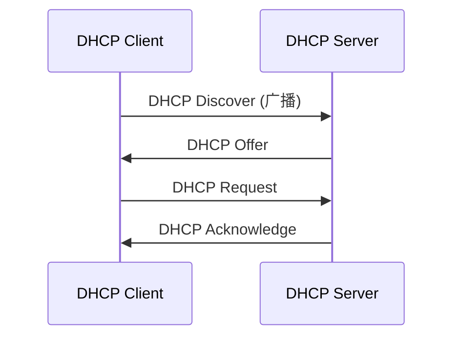

# 协议概述

DHCP（动态主机配置协议）是一种网络协议，用于自动向网络设备分配IP地址及其他相关网络配置。DHCP通过客户端与服务器之间的交互来简化网络设备的配置过程，使设备能够快速接入网络。

# 客户端服务端交互流程



在这个流程中，DHCP客户端和服务器的交互步骤如下：

1. **DHCP Discover**:
    - 客户端发送发现消息，寻找可用的DHCP服务器。这个消息是广播形式的，因为客户端在此时尚不知道网络中存在的DHCP服务器。
    - 消息中包含客户端的MAC地址和请求的IP地址（如果有的话）。

2. **DHCP Offer**:
    - 服务器接收到发现消息后，发送一个提供消息，告知客户端可以使用的IP地址及其他网络配置（如子网掩码、默认网关和DNS服务器）。
    - 提供消息是单播或广播的，取决于服务器的配置。

3. **DHCP Request**:
    - 客户端收到多个提供消息后，选择其中一个，并向该DHCP服务器发送请求，确认使用该IP地址。
    - 此请求消息也是广播的，以通知其他DHCP服务器该IP地址已被分配。

4. **DHCP Acknowledge**:
    - 服务器确认请求，并向客户端发送确认消息，完成IP地址分配。此时，客户端正式获得所请求的IP地址。

### 扩展阶段（可选）

在某些情况下，DHCP交互流程可能会包括以下步骤：

1. **DHCP Nak**:
    - 如果DHCP服务器无法满足客户端的IP地址请求（例如，所请求的IP地址已被分配），服务器会发送一个DHCP Nak（否定确认）消息，以告知客户端请求失败。
    - 客户端在收到Nak消息后，会重新开始DORA流程，发送新的Discover消息。

2. **DHCP Release**:
    - 当客户端不再需要分配的IP地址时（例如，设备关闭或断开网络），客户端可以发送一个DHCP Release消息给DHCP服务器，以释放该IP地址。
    - 这样，服务器可以将该IP地址重新分配给其他设备使用。

### DHCP租约

- 在整个过程中，DHCP服务器为分配的IP地址设置租约时间（Lease Time），表示客户端可以使用该地址的有效期限。
- 租约到期后，客户端需要重新请求IP地址，或者在租约到期前通过发送DHCP Request消息延长租约。

### 其他配置项

DHCP不仅可以用于动态分配IP地址，还可以配置其他网络参数，包括路由、MTU（最大传输单元）以及其他一些网络设置。下面是DHCP可以配置的一些常见选项：

### 1. 路由（默认网关）

- **功能**：DHCP服务器可以通过提供默认网关的IP地址来配置客户端的路由设置。客户端在接收到这个信息后，会将其设置为默认路由，从而能够访问其他网络。

### 2. MTU（最大传输单元）

- **功能**：DHCP可以指定网络接口的MTU值，帮助客户端配置合适的数据包大小，以便优化网络性能。

### 3. DNS服务器

- **功能**：DHCP可以提供一个或多个DNS服务器的IP地址，以便客户端能够解析域名。

### 4. 子网掩码

- **功能**：DHCP服务器可以提供子网掩码，帮助客户端正确识别网络地址和主机地址。

### 5. 主机名称

- **功能**：DHCP可以配置客户端的主机名称，方便在网络中识别设备。

### 6. NTP（网络时间协议）服务器

- **功能**：DHCP可以提供NTP服务器的IP地址，帮助客户端自动同步时间。

### 7. 其他网络参数

DHCP协议还支持许多其他选项，具体包括：

- **域名**：指定客户端所使用的域名。
- **WINS服务器**：配置Windows Internet名称服务（WINS）服务器。
- **广播地址**：指定子网的广播地址。
- **路由器选项**：配置多个路由器的IP地址。

# 简易的dhcp服务器实现

```go
package main

import (
	"fmt"
	"github.com/insomniacslk/dhcp/dhcpv4"
	"github.com/insomniacslk/dhcp/dhcpv4/server4"
	"log"
	"net"
	"test/allocators/bitmap"
	"time"
)

type Record struct {
	IP       net.IP
	expires  int
	hostname string
}

var recordsV4 = make(map[string]*Record)
var allocator, _ = bitmap.NewIPv4Allocator(net.ParseIP("172.20.0.2"), net.ParseIP("172.20.0.254"))

func handler(conn net.PacketConn, peer net.Addr, req *dhcpv4.DHCPv4) {
	res, err := dhcpv4.NewReplyFromRequest(req)
	if err != nil {
		log.Printf("MainHandler4: failed to build reply: %v", err)
		return
	}
	switch mt := req.MessageType(); mt {
	case dhcpv4.MessageTypeDiscover:
		res.UpdateOption(dhcpv4.OptMessageType(dhcpv4.MessageTypeOffer))
	case dhcpv4.MessageTypeRequest:
		res.UpdateOption(dhcpv4.OptMessageType(dhcpv4.MessageTypeAck))
	default:
		log.Printf("plugins/server: Unhandled message type: %v", mt)
		return
	}
	//autoconfigure
	{
		if res.MessageType() != dhcpv4.MessageTypeOffer || !res.YourIPAddr.IsUnspecified() {
			goto autoconfigureEnd
		}
		_, ok := req.AutoConfigure()
		if ok {
			res.UpdateOption(dhcpv4.OptAutoConfigure(dhcpv4.DoNotAutoConfigure))
		}
	}
autoconfigureEnd:
	//DNS
	{
		if req.IsOptionRequested(dhcpv4.OptionDomainNameServer) {
			res.Options.Update(dhcpv4.OptDNS(net.ParseIP("172.20.0.1"), net.ParseIP("114.114.114.114")))
		}
	}
	//IP router Mask
	{
		record, ok := recordsV4[req.ClientHWAddr.String()]
		hostname := req.HostName()
		if !ok {
			var ip net.IPNet
			ip, err = allocator.Allocate(net.IPNet{})
			if err != nil {
				return
			}
			rec := Record{
				IP:       ip.IP.To4(),
				expires:  int(time.Now().Add(time.Hour * 12).Unix()),
				hostname: hostname,
			}
			recordsV4[req.ClientHWAddr.String()] = &rec
			record = &rec
		} else {
			expiry := time.Unix(int64(record.expires), 0)
			if expiry.Before(time.Now().Add(time.Hour * 12)) {
				record.expires = int(time.Now().Add(time.Hour * 12).Round(time.Second).Unix())
				record.hostname = hostname
				recordsV4[req.ClientHWAddr.String()] = record
			}
		}

		res.Options.Update(dhcpv4.OptRouter(net.ParseIP("172.20.0.1")))
		res.Options.Update(dhcpv4.OptSubnetMask(net.IPv4Mask(255, 255, 255, 0)))
		res.YourIPAddr = record.IP
		res.Options.Update(dhcpv4.OptIPAddressLeaseTime((time.Hour * 12).Round(time.Second)))

	}
	//ServerId
	{
		serverID := net.ParseIP("172.20.0.1")
		if req.OpCode == dhcpv4.OpcodeBootRequest {
			if req.ServerIPAddr != nil &&
				!req.ServerIPAddr.Equal(net.IPv4zero) &&
				!req.ServerIPAddr.Equal(serverID.To4()) {
				return
			}
			res.ServerIPAddr = make(net.IP, net.IPv4len)
			copy(res.ServerIPAddr[:], serverID.To4())
			res.UpdateOption(dhcpv4.OptServerIdentifier(serverID.To4()))
		}
	}
	//回复
	if res != nil {
		if _, err = conn.WriteTo(res.ToBytes(), peer); err != nil {
			log.Printf("MainHandler4: WriteTo failed: %v", err)
		}
	} else {
		log.Print("MainHandler4: dropping request because response is nil")
	}
}

func main() {
	lAddr := net.UDPAddr{
		IP:   net.ParseIP("0.0.0.0"),
		Port: 67,
	}
	server, err := server4.NewServer("ens19", &lAddr, handler)
	if err != nil {
		fmt.Println(err)
	}
	err = server.Serve()
	if err != nil {
		return
	}
}

```

# 相关链接

- [DHCP协议](https://en.wikipedia.org/wiki/Dynamic_Host_Configuration_Protocol)
- [dhcp选项](https://web.archive.org/web/20211006053433/http://www.networksorcery.com/enp/protocol/bootp/options.htm)
