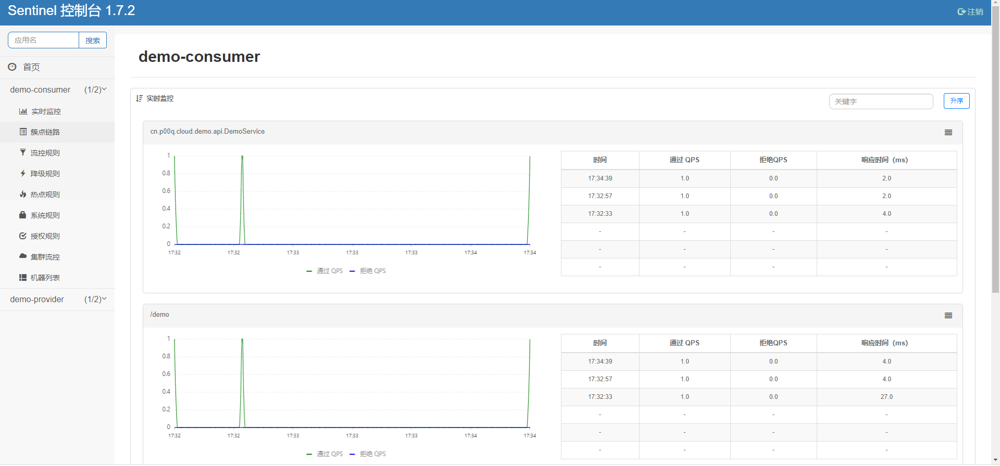

# Sentinel 

随着微服务的流行，服务和服务之间的稳定性变得越来越重要。Sentinel 是面向分布式服务架构的流量控制组件，主要以流量为切入点，从流量控制、熔断降级、系统自适应保护等多个维度来帮助您保障微服务的稳定性。
[Sentinel 官网](https://sentinelguard.io)

# 安装Sentinel 

[Github下载](https://github.com/alibaba/Sentinel/releases)
版本:sentinel-dashboard-1.7.2.jar

新建一个sentinel目录 把jar放入
新建启动文件 run.sh
```
nohup java -Dserver.port=8091 -Dproject.name=sentinel-dashboard -jar sentinel.jar
```
登录
http://IP:8091
默认用户名密码:sentinel

# 整合Dubbo

接着[上一篇](https://p00q.cn/archives/springcloudalibaba%E6%95%B4%E5%90%88nacos%E5%92%8Cdubbo)的服务整合

## 新建一个POM项目
sentinel


pom
```
<?xml version="1.0" encoding="UTF-8"?>
<project xmlns="http://maven.apache.org/POM/4.0.0"
         xmlns:xsi="http://www.w3.org/2001/XMLSchema-instance"
         xsi:schemaLocation="http://maven.apache.org/POM/4.0.0 http://maven.apache.org/xsd/maven-4.0.0.xsd">
    <parent>
        <artifactId>spring-cloud-alibaba-parent</artifactId>
        <groupId>cn.p00q</groupId>
        <version>1.0.0-SNAPSHOT</version>
    </parent>
    <modelVersion>4.0.0</modelVersion>
    <artifactId>sentinel</artifactId>
    <dependencies>
        <dependency>
            <groupId>com.alibaba.cloud</groupId>
            <artifactId>spring-cloud-starter-alibaba-sentinel</artifactId>
        </dependency>
        <dependency>
            <groupId>com.alibaba.csp</groupId>
            <artifactId>sentinel-apache-dubbo-adapter</artifactId>
        </dependency>
    </dependencies>
</project>
```
## 依赖和配置

消费者和提供者都依赖sentinel项目
```
        <dependency>
            <groupId>cn.p00q</groupId>
            <artifactId>sentinel</artifactId>
            <version>${parent.version}</version>
        </dependency>
```
在配置中心添加配置
```
server:
  port: 8001
spring:
  cloud:
    sentinel:
      eager: true # 是否饥饿加载。默认为 false 关闭
      transport:
        dashboard: 127.0.0.1:8091 # Sentinel 控制台地址
```

## 控制台
访问http://127.0.0.1:8001/demo
然后看控制台

