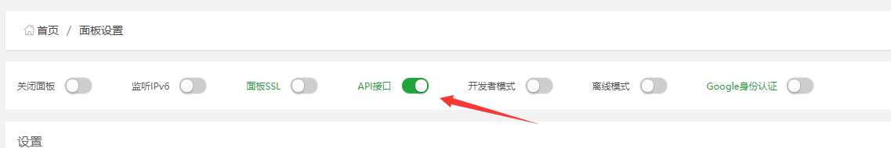
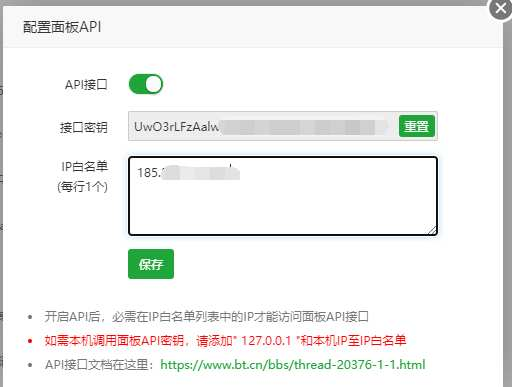
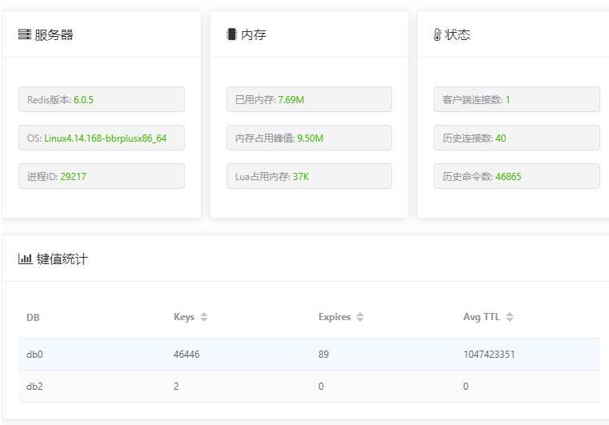

# 迁移准备

准备换服务器了，在目标服务已经安装完成了 MySQL 和 Redis 数据库。
源MySQL版本：5.5.62  目标MySQL版本：5.7.30
源Redis版本：3.2.100  目标Redis版本：6.0.5

# MySQL迁移

上次我试过 SQLyog 连接两边的数据库，复制数据比较麻烦需要手动创建数据库和用户。
这次我两边服务器都安装了宝塔控制面板所以我试试宝塔的数据迁移api。需要在源服务器上安装插件。

源数据服务器是window 目标是linux


在目标机器控制面板打开API


并且设置IP白名单和获取API密钥


遇到了这样一个问题


在安装完PHP7.3后继续


原来并不能从window服务器迁移至linux服务器只能手动了。

# Redis迁移

通过 redis-shake 进行Redis数据库的迁移
[使用RDB文件迁移的方式](https://help.aliyun.com/document_detail/116378.html?spm=a2c4g.11186623.6.629.5f137892cAsnwf)
下载redis-shake [下载](https://github.com/alibaba/RedisShake/releases/download/release-v2.0.2-20200506/redis-shake-v2.0.2.tar.gz)
解压后打开 `redis-shake.conf`根据自己情况修改
```
#备份文件（RDB文件）的路径，可使用相对路径或绝对路径。
source.rdb.input = C:\BtSoft\redis\dump.rdb
#目的Redis的连接地址与端口号。
target.address = 185.x.x.x:6379
#目的Redis的连接密码。
target.password_raw=123123
#设置待迁移的数据在目的Redis中的逻辑数据库名，默认值为-1。
例如，要将所有数据迁移到目的Redis中的DB10，则需将此参数的值设置为10。当该值设置为-1时，逻辑数据库名在源Redis和目的Redis中的名称相同，即源Redis中的DB0将被迁移至目的Redis中的DB0，DB1将被迁移至DB1，以此类推。
target.db=-1
#如果目的Redis有与RDB文件中相同的key，是否覆盖，可选值：
true（覆盖）
false（不覆盖）
rewrite=true
```
linux执行
```
./redis-shake -type=restore -conf=redis-shake.conf
```
window
```
redis-shake -type=restore -conf=redis-shake.conf
```
复制完成

