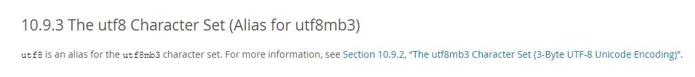

# 啥为啥搜索😃报500
我 MySQL 表里面的字符集是 `utf-8` 按理说应该支持emoji才对。
[看官方文档utf-8](https://dev.mysql.com/doc/refman/5.6/en/charset-unicode-utf8.html)

原来 MySQL 默认的 `utf-8` 是`utf8mb3`的别称。而`utf8mb3`是3字节的不支持emoji的所以SQL查询emoji服务端会报错就会返回500了

# 支持😃的utf-8

`utf8mb4 `

 - 设置MySQL全局参数为utf8mb4
character_set_server=utf8mb4
- 设置库的字符集为 utf8mb4
ALTER DATABASE database_name CHARACTER SET = utf8mb4 COLLATE = utf8mb4_unicode_ci;
- 设置表的字符集为 utf8mb4
ALTER TABLE table_name CONVERT TO CHARACTER SET utf8mb4 COLLATE utf8mb4_unicode_ci;
- 设置字段的字符集为 utf8mb4
