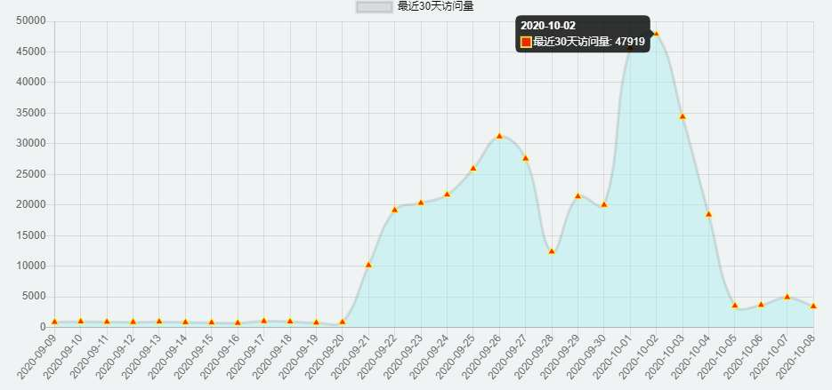
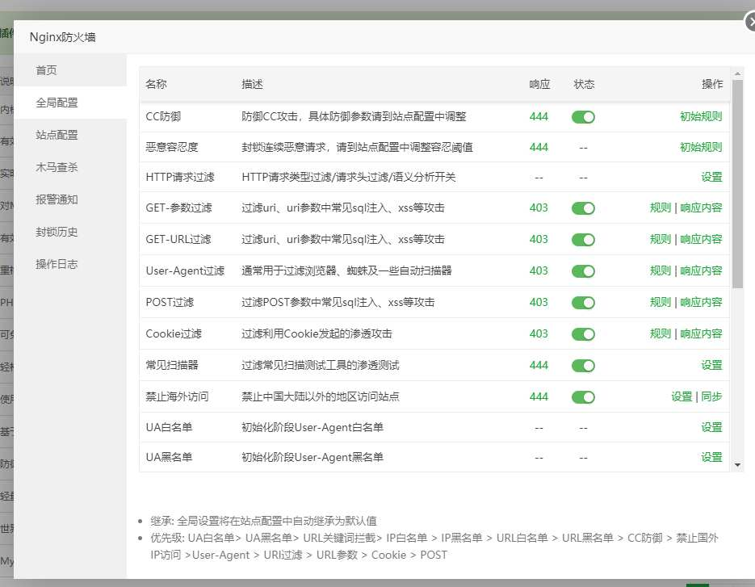

# 遭受攻击

前两天我的小水管服务器被cc攻击,对方一直调我项目中的一个搜索接口,有时命中了关键词会返回很多数据,造成流量消耗。
达到了每天几万IP的访问,每秒20+

这是某一天的流量和请求数
||
虽然不是很多,但是在我小水管服务器(2Mpbs)看来已经是难以承受。
导致我的服务器流量被消耗完毕,导致项目无法访问软件无法正常使用。

# 解决

在我发现的时候流量已经被刷完了,导致服务器无法访问。
还好我的服务并不部署在这台服务器上,而是部署在k8s集群上。这台服务器只是起个网关代理作用。
于是我又租了一台服务器50M的服务器18一个月,虽然只有0.5g内存但是安装个Nginx没得问题。

[低价服务器](http://yun.0220.cn/page.aspx?c=referral&u=8155)

购买后我先安装了宝塔面板和nginx。然后使用了一款里面的插件 Nginx防火墙 
然后通过查看日志请求URL然后写个正则对请求进行黑名单限制就减少了大部分攻击和流量。

至此APP又能正常使用
