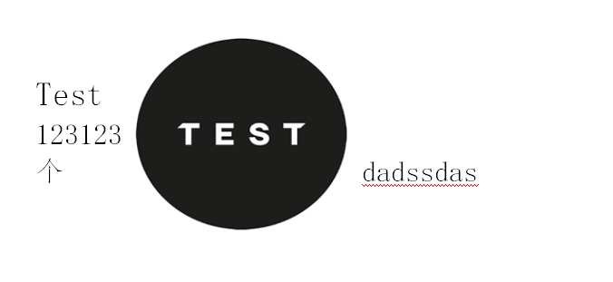
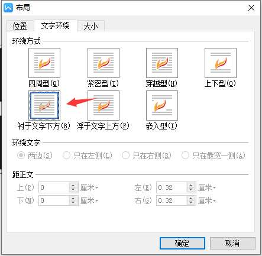
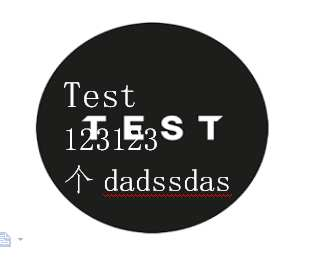
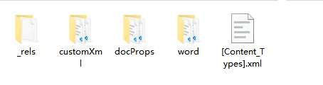

# unioffice
使用go处理offce是一个开源库,不过这个库需要付费授权[unioffice](https://unidoc.io/unioffice/)
没有相关文档只有github上的几个例子

# 遇到的问题
在处理word的时候需求是将图片设为封面背景,但是当图片添加进去后放大到页面大小会挤压文字

我想实现的效果:
|
没有文档我只找到了这个API`t.SetTextWrapSquare()`设置文字环绕图片,但是没有用还是解决不了.

# 尝试查看docx文件结构
据了解,word内部其实就是xml.
我首先直接用vscode打开查看,发现是个二进制文件.
后有发现原来可以解压处出来:

在`word`文件夹下的`document.xml`就是主要文档内容
我首先将同一文档一个通过wps手动实现图片衬于文字下方,一个没有实现.
然后分别对比xml(需要先格式化一下不然压缩了的不好看)

## 原文档:
```
<w:p>
            <w:r>
                <w:drawing>
                    <wp:anchor
                        xmlns="http://schemas.openxmlformats.org/drawingml/2006/wordprocessingDrawing"
                        xmlns:a="http://schemas.openxmlformats.org/drawingml/2006/main"
                        xmlns:pic="http://schemas.openxmlformats.org/drawingml/2006/picture"
                        xmlns:r="http://schemas.openxmlformats.org/officeDocument/2006/relationships"
                        xmlns:w="http://schemas.openxmlformats.org/wordprocessingml/2006/main"
                        xmlns:wp="http://schemas.openxmlformats.org/drawingml/2006/wordprocessingDrawing"
                        xmlns:xml="http://www.w3.org/XML/1998/namespace" simplePos="0" relativeHeight="0" behindDoc="1" locked="0" layoutInCell="0" allowOverlap="1">
                        <wp:simplePos x="0" y="0"/>
                        <wp:positionH relativeFrom="page">
                            <wp:align>center</wp:align>
                        </wp:positionH>
                        <wp:positionV relativeFrom="page">
                            <wp:align>bottom</wp:align>
                        </wp:positionV>
                        <wp:extent cx="7574411" cy="3074404"/>
                        <wp:wrapNone/>
                        <wp:docPr id="116590931" name=""/>
                        <wp:cNvGraphicFramePr/>
                        <a:graphic>
                            <a:graphicData uri="http://schemas.openxmlformats.org/drawingml/2006/picture">
                                <pic:pic
                                    xmlns="http://schemas.openxmlformats.org/drawingml/2006/picture"
                                    xmlns:pic="http://schemas.openxmlformats.org/drawingml/2006/picture"
                                    xmlns:xml="http://www.w3.org/XML/1998/namespace">
                                    <pic:nvPicPr>
                                        <pic:cNvPr id="116590931" name=""/>
                                        <pic:cNvPicPr/>
                                    </pic:nvPicPr>
                                    <pic:blipFill>
                                        <a:blip r:embed="rId5"/>
                                        <a:stretch>
                                            <a:fillRect/>
                                        </a:stretch>
                                    </pic:blipFill>
                                    <pic:spPr>
                                        <a:xfrm>
                                            <a:off x="0" y="0"/>
                                            <a:ext cx="1876" cy="740"/>
                                        </a:xfrm>
                                        <a:prstGeom prst="rect"/>
                                    </pic:spPr>
                                </pic:pic>
                            </a:graphicData>
                        </a:graphic>
                    </wp:anchor>
                </w:drawing>
            </w:r>
        </w:p>
```
## 修改过

```
<w:p>
            <w:bookmarkStart w:id="0" w:name="_GoBack"/>
            <w:r>
                <w:drawing>
                    <wp:anchor distT="0" distB="0" distL="114935" distR="114935" simplePos="0" relativeHeight="0" behindDoc="1" locked="0" layoutInCell="0" allowOverlap="1">
                        <wp:simplePos x="0" y="0"/>
                        <wp:positionH relativeFrom="page">
                            <wp:align>center</wp:align>
                        </wp:positionH>
                        <wp:positionV relativeFrom="page">
                            <wp:align>bottom</wp:align>
                        </wp:positionV>
                        <wp:extent cx="7574280" cy="3074670"/>
                        <wp:effectExtent l="0" t="0" r="7620" b="11430"/>
                        <wp:wrapNone/>
                        <wp:docPr id="116590931" name="图片 116590931"/>
                        <wp:cNvGraphicFramePr/>
                        <a:graphic
                            xmlns:a="http://schemas.openxmlformats.org/drawingml/2006/main">
                            <a:graphicData uri="http://schemas.openxmlformats.org/drawingml/2006/picture">
                                <pic:pic
                                    xmlns:pic="http://schemas.openxmlformats.org/drawingml/2006/picture">
                                    <pic:nvPicPr>
                                        <pic:cNvPr id="116590931" name="图片 116590931"/>
                                        <pic:cNvPicPr/>
                                    </pic:nvPicPr>
                                    <pic:blipFill>
                                        <a:blip r:embed="rId7"/>
                                        <a:stretch>
                                            <a:fillRect/>
                                        </a:stretch>
                                    </pic:blipFill>
                                    <pic:spPr>
                                        <a:xfrm>
                                            <a:off x="0" y="0"/>
                                            <a:ext cx="1876" cy="740"/>
                                        </a:xfrm>
                                        <a:prstGeom prst="rect">
                                            <a:avLst/>
                                        </a:prstGeom>
                                    </pic:spPr>
                                </pic:pic>
                            </a:graphicData>
                        </a:graphic>
                    </wp:anchor>
                </w:drawing>
            </w:r>
            <w:bookmarkEnd w:id="0"/>
        </w:p>
```
## 发现

在经过几次反复对照修改后
发现决定图片衬于文字下方的属性`behindDoc="1"`同时 `<wp:wrapNone/>`(图片不挤兑文字)

通过以下代码修改

```
t.SetTextWrapNone()
t.X().BehindDocAttr=true
```
大致代码如下:
```
	bgImg, err := common.ImageFromFile(bgPath)
	if err != nil {
		logger.Error(err)
	}
	//向文档添加图片
	imgRef, err := doc.AddImage(bgImg)
	//绘制图片
	t, err := doc.AddParagraph().AddRun().AddDrawingAnchored(imgRef)
	if err != nil {
		logger.Error(err)
	}
	//设置图片在文档中心
	t.SetAlignment(wml.WdST_AlignHCenter, wml.WdST_AlignVCenter)
	//设置大小为页面大小
	t.SetSize(21*measurement.Centimeter, 29.7*measurement.Centimeter)
	//文字不环绕图片
	t.SetTextWrapNone()
	//图片衬于文字下方
	t.X().BehindDocAttr=true
```
