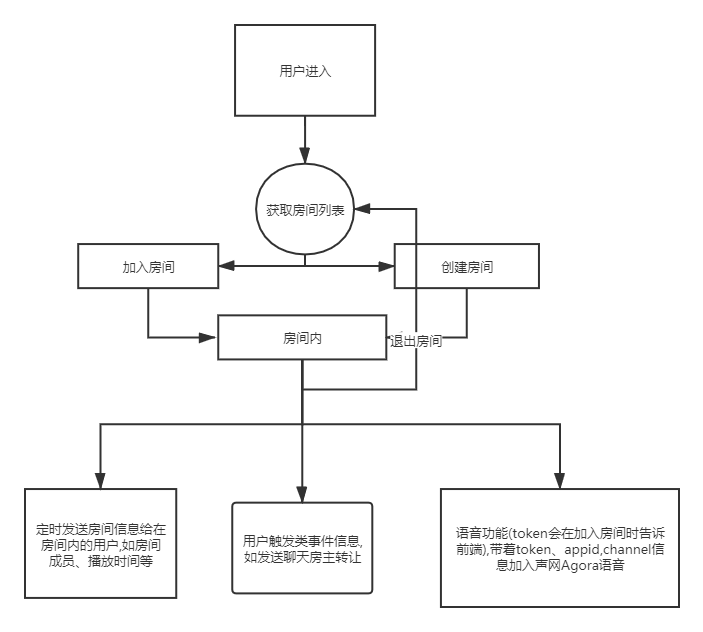

# 功能介绍
用户创建房间后可邀请好友一同观看影视并支持房间语音.
[线上体验地址](https://dbys.vip/yiqikan)
最后效果图:

地址:[一起看](https://dbys.vip/yiqikan)
# 用到的东西
播放器:[DPlayer](https://github.com/MoePlayer/DPlayer)
p2p加速:[cdnbye](http://www.cdnbye.com/)
语音:[声网Agora](https://agora.io/)
前端页面使用jq完成的单页应用.
后端基于[淡白影视](https://github.com/Programming-With-Love/dbys)继续开发 socket服务

# 服务大致流程


# 实现源码
## 前端
[前端单页源码](https://github.com/Programming-With-Love/dbys/blob/master/src/main/resources/templates/yiqikan/index.html)

## 后端
socket类
```java
/**
 * @author DanBai
 * @create 2020-03-10 22:57
 * @desc 同步影院sk
 **/
package com.danbai.ys.websocket;

import com.alibaba.fastjson.JSON;
import com.alibaba.fastjson.JSONException;
import com.alibaba.fastjson.JSONObject;
import com.danbai.ys.entity.CinemaRoom;
import org.slf4j.Logger;
import org.slf4j.LoggerFactory;
import org.springframework.scheduling.annotation.Scheduled;
import org.springframework.stereotype.Component;
import javax.websocket.*;
import javax.websocket.server.PathParam;
import javax.websocket.server.ServerEndpoint;

import java.util.concurrent.ConcurrentHashMap;

@ServerEndpoint("/cinema/socket/{username}")
@Component
public class CinemaSocket {
    /**
     * 用户名
     */
    private String username;
    /**
     * 房间id 0为大厅
     */
    private int roomId=0;
    /**
     *  连接池
     */
    public static ConcurrentHashMap<String, CinemaSocket> POOL = new ConcurrentHashMap<>();
    /**
     * 房间池
     */
    public static ConcurrentHashMap<Integer, CinemaRoom> ROOM_POOL = new ConcurrentHashMap<>();
    public static ConcurrentHashMap<String, Integer> DELETE_P00L =new ConcurrentHashMap<>();
    /**
     * 与某个客户端的连接会话，需要通过它来给客户端发送数据
     */
    private Session session;

    private static Logger log = LoggerFactory.getLogger(CinemaSocket.class);

    /**
     * 连接建立成功调用的方法
     */
    @OnOpen
    public void onOpen(Session session, @PathParam("username") String username) {
        this.session = session;
        this.username=username;
        if(DELETE_P00L.containsKey(username)){
            this.roomId=DELETE_P00L.get(username);
        }
        //加入POOL中
        POOL.put(session.getId(),this);
        //断线重连加房间
        if(roomId!=0){
            CinemaRoom room= ROOM_POOL.get(roomId);
            if(room!=null){
                ROOM_POOL.get(roomId).getSockets().add(session.getId());
            }
        }
        //在线数加1
        log.info("有新连接加入！当前在线人数为" + POOL.size());
        CinemaSocketManagement.info(session.getId());
    }

    /**
     * 连接关闭调用的方法
     */
    @OnClose
    public void onClose(Session session) {
        //从POOL中删除
        CinemaSocket cinemaSocket = POOL.get(session.getId());
        if(cinemaSocket!=null){
            DELETE_P00L.put(cinemaSocket.getUsername(),cinemaSocket.roomId);
        if(cinemaSocket.roomId!=0){
            CinemaSocketManagement.exitRoom(session.getId());
        }
        }
        POOL.remove(session.getId());
        log.info("有一连接关闭！当前在线人数为" + POOL.size());
        log.info("房间数" + ROOM_POOL.size());
    }

    /**
     * 收到客户端消息后调用的方法
     *
     * @param message 客户端发送过来的消息
     */
    @OnMessage
    public void onMessage(String message,Session session) {
        String id=session.getId();
        CinemaSocket cinemaSocket = POOL.get(id);
        if(cinemaSocket!=null){
            try {
                JSONObject jsonObject = JSON.parseObject(message);
            String type = jsonObject.getString("type");
            if(jsonObject!=null&&type!=null){

                    switch (type){
                        case "info":CinemaSocketManagement.info(id);break;
                        case "join":CinemaSocketManagement.joinRoom(id,jsonObject.getInteger("roomId"),jsonObject.getString("pass"));break;
                        case "newRoom":CinemaSocketManagement.newRoom(id,jsonObject.getString("name"),jsonObject.getString("pass"));break;
                        case "exitRoom":CinemaSocketManagement.exitRoom(id);break;
                        case "roomInfo":CinemaSocketManagement.roomInfo(id);break;
                        case  "sendChat":CinemaSocketManagement.sendChat(id,jsonObject.getString("msg"));break;
                        case  "sendUrl":CinemaSocketManagement.sendUrl(id,jsonObject.getString("url"));break;
                        case  "sendTime":CinemaSocketManagement.sendTime(id,jsonObject.getDouble("time"));break;
                        case "transfer":CinemaSocketManagement.transfer(id,jsonObject.getString("id"));break;
                        default:log.info(message);
                    }}
                } catch (NullPointerException e) {
                    e.printStackTrace();
                }catch (JSONException e){
                    log.info(message);
                    e.printStackTrace();
                }
            }

    }

    /**
     * 发生错误时调用
     *
     * @OnError 错误消息
     * @param session session
     **/
    @OnError
    public void onError(Session session, Throwable error) {
        log.error("onMessage方法异常" + error.toString());
        error.printStackTrace();
    }


    /**
     * 发送消息需注意方法加锁synchronized，避免阻塞报错
     * 注意session.getBasicRemote()与session.getAsyncRemote()的区别
     *
     * @param message 消息
     */
    public void sendMessage(String message){
        synchronized (session) {
            if (session.isOpen()) {
                this.session.getAsyncRemote().sendText(message);
            }
        }
    }

    public String getUsername() {
        return username;
    }

    public void setUsername(String username) {
        this.username = username;
    }

    public int getRoomId() {
        return roomId;
    }

    public void setRoomId(int roomId) {
        this.roomId = roomId;
    }

    public Session getSession() {
        return session;
    }

    public void setSession(Session session) {
        this.session = session;
    }
    @Scheduled(cron="0 */1 * * * ?")
    public void examine(){
        DELETE_P00L.clear();
        //删除断开的链接
        POOL.forEach((id,e)->{
            if(!e.session.isOpen()){
                POOL.remove(id);
            }
        });
        ROOM_POOL.forEach((id,room)->{
            if(POOL.get(room.getAuthorId())==null){
                if(room.getSockets().size()<2){
                    ROOM_POOL.remove(id);
                }else {
                    //新房主
                    String newId = CinemaSocket.ROOM_POOL.get(id).getSockets().iterator().next();
                    //转让
                    if (newId != null) {
                        CinemaSocket.ROOM_POOL.get(roomId).setAuthorId(newId);
                    }
                }
            }
        });
    }
}

```
socket管理类
```java
/**
 * @author DanBai
 * @create 2020-03-11 0:22
 * @desc socket管理
 **/
package com.danbai.ys.websocket;

import com.alibaba.fastjson.JSONArray;
import com.alibaba.fastjson.JSONObject;
import com.danbai.ys.async.CinemaSocketAsync;
import com.danbai.ys.entity.CinemaRoom;
import com.danbai.ys.utils.Md5;
import com.danbai.ys.utils.SpringUtil;

import io.agora.media.RtcTokenBuilder;
import io.agora.sample.RtcTokenBuilderSample;
import org.springframework.stereotype.Component;

@Component
public class CinemaSocketManagement {
    /**
     * 加入房间
     *
     * @param socketId socketId
     * @param roomId   房间id
     * @param pass     房间密码
     */
    public static void joinRoom(String socketId, int roomId, String pass) {
        JSONObject jsonObject = new JSONObject();
        jsonObject.put("type", "join");
        boolean ok = false;
        CinemaRoom cinemaRoom = CinemaSocket.ROOM_POOL.get(roomId);
        //是否需要密码
        if (cinemaRoom != null && cinemaRoom.getPass() != null) {
            if (cinemaRoom.getPass().equals(pass)) {
                //密码正确
                CinemaSocket.ROOM_POOL.get(roomId).getSockets().add(socketId);
                CinemaSocket.POOL.get(socketId).setRoomId(roomId);
                ok = true;
            }
        } else {
            CinemaSocket.ROOM_POOL.get(roomId).getSockets().add(socketId);
            CinemaSocket.POOL.get(socketId).setRoomId(roomId);
            ok = true;
        }
        jsonObject.put("ok", ok);
        if(ok){
            //语音token
            RtcTokenBuilder token = new RtcTokenBuilder();
            int timestamp = (int)(System.currentTimeMillis() / 1000 + 3600);
            String result = token.buildTokenWithUid(RtcTokenBuilderSample.appId, RtcTokenBuilderSample.appCertificate,
                    Md5.getMD5LowerCase(cinemaRoom.getName()+cinemaRoom.getId()), Integer.parseInt(socketId,16), RtcTokenBuilder.Role.Role_Publisher, timestamp);
            jsonObject.put("token",result);
            jsonObject.put("channel",Md5.getMD5LowerCase(cinemaRoom.getName()+cinemaRoom.getId()));
            jsonObject.put("id",String.valueOf(cinemaRoom.getId()));
            jsonObject.put("name",cinemaRoom.getName());
            jsonObject.put("uid",Integer.parseInt(socketId,16));
        }
        CinemaSocket.POOL.get(socketId).sendMessage(jsonObject.toJSONString());
    }

    /**
     * 创建房间
     *
     * @param socketId socketId
     * @param name     房间名字
     * @param pass     密码
     */
    public static void newRoom(String socketId, String name, String pass) {
        if(name!=null){
            int id = CinemaSocket.ROOM_POOL.size() + 1;
            if(pass.equals("")){
                pass=null;
            }
            CinemaRoom cinemaRoom = new CinemaRoom(id, name, pass, socketId);
            CinemaSocket.ROOM_POOL.put(cinemaRoom.getId(), cinemaRoom);
            joinRoom(socketId, id, pass);
        }
    }

    /**
     * 发送大厅消息
     *
     * @param msg 消息
     */
    public static void sendLobby(String msg) {
        CinemaSocket.POOL.forEach((id, socket) -> {
            if (socket.getRoomId() == 0) {
                socket.sendMessage(msg);
            }
        });
    }

    /**
     * 退出房间
     *
     * @param socketId socketId
     */
    public static void exitRoom(String socketId) {
        int roomId = CinemaSocket.POOL.get(socketId).getRoomId();
        //房主判断
        CinemaRoom room = CinemaSocket.ROOM_POOL.get(roomId);
        if (room != null) {
            if (room.getAuthorId().equals(socketId)) {
                System.out.println("是房主");
                //大于1人转让房主
                if (room.getSockets().size() > 1) {
                    System.out.println("转让");
                    //退出房间
                    CinemaSocket.ROOM_POOL.get(roomId).getSockets().remove(socketId);
                    //新房主
                    String newId = CinemaSocket.ROOM_POOL.get(roomId).getSockets().iterator().next();
                    //转让
                    if (newId != null) {
                        CinemaSocket.ROOM_POOL.get(roomId).setAuthorId(newId);
                    }

                } else {
                    //删除房间
                    CinemaSocket.ROOM_POOL.remove(roomId);
                }
            } else {
                //退出
                System.out.println("房客退出");
                CinemaSocket.ROOM_POOL.get(roomId).getSockets().remove(socketId);
            }
        }
    }

    /**
     * 获取大厅房间信息
     *
     * @param socketId socketId
     * @return
     */
    public static void info(String socketId) {
        JSONObject jsonObject = new JSONObject();
        jsonObject.put("type", "info");
        //在线人数
        jsonObject.put("online", CinemaSocket.POOL.size());
        //遍历添加房间信息
        JSONArray rooms = new JSONArray();
        CinemaSocket.ROOM_POOL.forEach((id, room) -> {
            JSONObject roomJson = new JSONObject();
            roomJson.put("id", id);
            roomJson.put("name", room.getName());
            roomJson.put("online", room.getSockets().size());
            roomJson.put("author", CinemaSocket.POOL.get(room.getAuthorId()).getUsername());
            roomJson.put("needPass", room.getPass() == null ? false : true);
            rooms.add(roomJson);
        });
        jsonObject.put("rooms", rooms);
        CinemaSocket.POOL.get(socketId).sendMessage(jsonObject.toJSONString());

    }

    /**
     * 房间信息
     *
     * @param socketId
     */
    public static void roomInfo(String socketId) {
        JSONObject roomJson = new JSONObject();
        roomJson.put("type", "roomInfo");
        CinemaSocket cinemaSocket = CinemaSocket.POOL.get(socketId);
        CinemaRoom room = CinemaSocket.ROOM_POOL.get(cinemaSocket.getRoomId());
        roomJson.put("id", room.getId());
        roomJson.put("name", room.getName());
        roomJson.put("online", room.getSockets().size());
        roomJson.put("url",room.getUrl());
        roomJson.put("time",room.getTime());
        roomJson.put("author", CinemaSocket.POOL.get(room.getAuthorId()).getUsername());
        JSONArray users = new JSONArray();
        room.getSockets().forEach(id -> {
            JSONObject user = new JSONObject();
            user.put("id", id);
            user.put("username", CinemaSocket.POOL.get(id).getUsername());
            users.add(user);
        });
        roomJson.put("users",users);

        CinemaSocket.POOL.get(socketId).sendMessage(roomJson.toJSONString());
    }
    public static void sendChat(String socketId,String msg){
        CinemaSocket cinemaSocket = CinemaSocket.POOL.get(socketId);
        CinemaRoom room = CinemaSocket.ROOM_POOL.get(cinemaSocket.getRoomId());
        JSONObject sendMsg = new JSONObject();
        sendMsg.put("type","sendChat");
        sendMsg.put("id",socketId);
        sendMsg.put("roomId",room.getId());
        sendMsg.put("username",cinemaSocket.getUsername());
        sendMsg.put("msg",msg);
        SpringUtil.getBean(CinemaSocketAsync.class).sendRoomMsg(room.getId(),sendMsg.toJSONString());
    }
    public static void sendUrl(String socketId,String url){
        CinemaSocket cinemaSocket = CinemaSocket.POOL.get(socketId);
        CinemaRoom room = CinemaSocket.ROOM_POOL.get(cinemaSocket.getRoomId());
        if(room.getAuthorId().equals(socketId)){
            CinemaSocket.ROOM_POOL.get(cinemaSocket.getRoomId()).setUrl(url);
            JSONObject sendMsg = new JSONObject();
            sendMsg.put("type","sendUrl");
            sendMsg.put("url",url);
            SpringUtil.getBean(CinemaSocketAsync.class).sendRoomMsgPassAuthor(room.getId(),sendMsg.toJSONString());
        }
    }
    public static void sendTime(String socketId,double time){
        CinemaSocket cinemaSocket = CinemaSocket.POOL.get(socketId);
        CinemaRoom room = CinemaSocket.ROOM_POOL.get(cinemaSocket.getRoomId());
        if(room.getAuthorId().equals(socketId)){
            CinemaSocket.ROOM_POOL.get(cinemaSocket.getRoomId()).setTime(time);
            JSONObject sendMsg = new JSONObject();
            sendMsg.put("type","sendTime");
            sendMsg.put("time",time);
            SpringUtil.getBean(CinemaSocketAsync.class).sendRoomMsgPassAuthor(room.getId(),sendMsg.toJSONString());
        }
    }
    public static void transfer(String socketId,String transferId){
        CinemaSocket cinemaSocket = CinemaSocket.POOL.get(socketId);
        CinemaRoom room = CinemaSocket.ROOM_POOL.get(cinemaSocket.getRoomId());
        if(room.getAuthorId().equals(socketId)){
            CinemaSocket.ROOM_POOL.get(cinemaSocket.getRoomId()).setAuthorId(transferId);
        }
    }
}

```
# 完感 
通过实现这个功能,还收获了一些其他的知识,nginx代理websocket、java多线程map、web语音.

