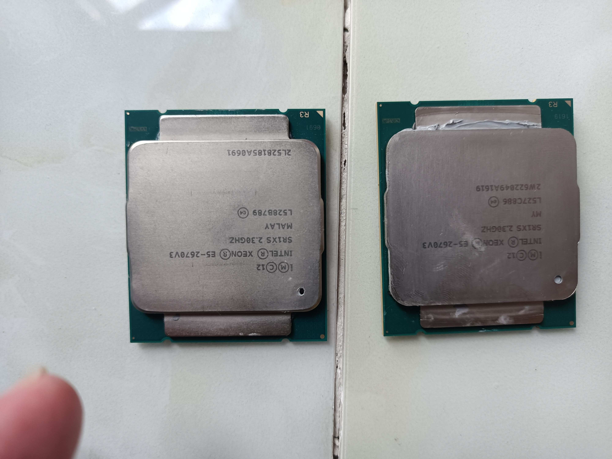
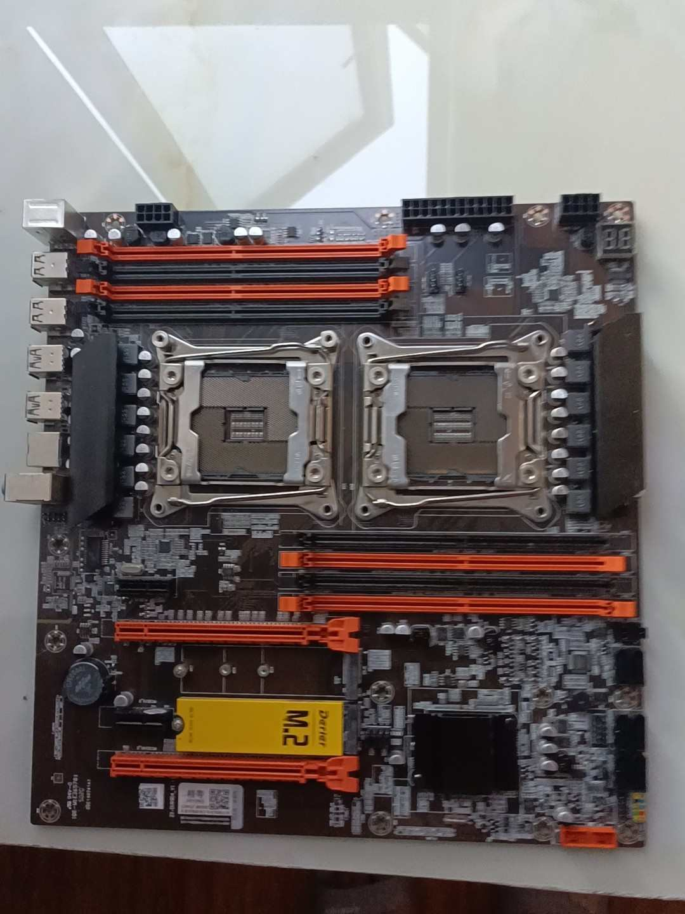

# 装机

在今年4月份时萌生了装一台多核cpu的电脑。于是在淘宝和京东分别购买了以下配置。
## 配件

|部件|产品名称|买入渠道|价格|
|-------|-------|-------|-------|
|CPU|E5 2670V3 *2|淘宝|770|
|CPU风扇1|弗博思静音x99 水冷散热|淘宝|239|
|内存1|镁光ddr4 16G|淘宝|305|
|内存2|镁光ddr4 16G|JD|459|
|硬盘|阿斯加特500G M.2固态|JD|389|
|机箱|九州风神玄冰50|JD|249|
|电源|鑫谷额定750w金牌|JD|499|
|主板|精粤x99双路主板|JD|697|
|CPU风扇2|超频三东海x4s|JD|83|
|显卡|盈通GT730|JD|378|

总共合计4068元

## 图集

# 卖出

在历经6、7月的炙烤下我实在忍不了了。这机子放在旁边一玩个游戏温度直接起飞旁边就像有个熔炉一样。于是我就把它拆了卖了，留下机箱、电源、显卡、风扇硬盘。
现在看着购入时的价格，我真是个大傻逼。

在海鲜市场出卖价格如下

|部件|价格|亏损|
|-------|-------|-------|
|CPU*2|480|290|
|内存*2|400|356|
|主板|400|297|

# 总结

装机不能心急，不然可能损失惨重。
不要再去搞洋垃圾了越来越不值钱。
发热严重还耗电，血亏。
框框多是真的。
