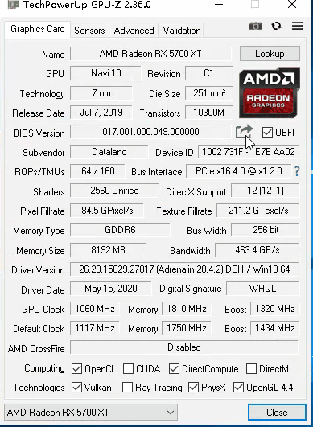
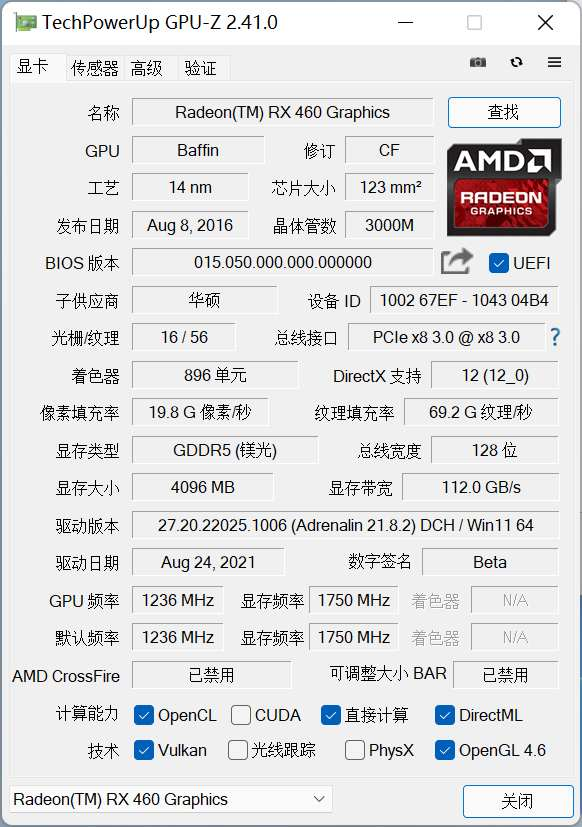
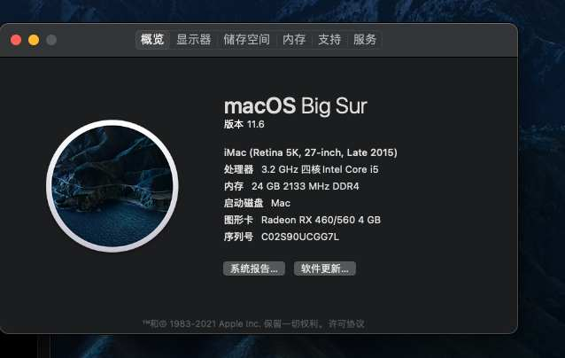

# 升级显卡

原来我的黑苹果使用的是gt730很遗憾的是不支持4k@60所以在前两天入了一张rx460 但是不成想讯景这个牌子的显卡黑果好多都有问题，我的显卡也出现了启动一直读条的问题。起初我以为是efi的问题整了好半天都不行，然后我就想着挂海鲜市场给卖了。不成想今早来了个人说这张卡是可以支持的需要刷BIOS，于是今天我看了一番教程，下班回家后开始了操作。

# 刷BIOS
注意，刷BIOS有风险。
## 准备工作

- [DDU 可以用来卸载驱动](https://danbai-cloud.oss-cn-chengdu.aliyuncs.com/uploads%2F2021%2F09%2F17%2F7XDa60Ds_DDU%20v18.0.4.3.exe?Expires=1631885142) 非必须
- [GPU-Z 查看显卡信息](https://danbai-cloud.oss-cn-chengdu.aliyuncs.com/uploads%2F2021%2F09%2F17%2FfwwLKjFC_GPU-Z%20v2.41.0%20%E6%B1%89%E5%8C%96%E7%89%88.exe?Expires=1631885212)
- [amdvbflashWin 刷bios工具](https://danbai-cloud.oss-cn-chengdu.aliyuncs.com/uploads%2F2021%2F09%2F17%2FIE6OTnpD_amdvbflashWin.zip?Expires=1631885284) 最新版我用会出错 2.93最好用
- [vgabios 下载](https://www.techpowerup.com/vgabios/)

## 挑选vbios

同阵营、同型号（极个别可以跨型号）
gpu核心频率差距不大、内存颗粒一致功耗等等
我刷的是华硕的 bios 最先刷的蓝宝石的结果 LOL 1FPS
技嘉的不是满血，唉~ 不过对我来够用了。

## 备份

GPU-Z除了查看以外还能备份BIOS

顺便在这保存一下我的备份
[备份rx460 bios](https://danbai-cloud.oss-cn-chengdu.aliyuncs.com/uploads%2F2021%2F09%2F17%2FUD8d1JeO_Baffin.rom?Expires=1631886043)


## 刷bios操作

以下命令需cmd管理员身份运行然后进入amdvbflash目录执行

1、解锁BIOS

```
amdvbflash.exe -unlockrom 0
```

2、刷入BIOS

```
amdvbflash -f -p 0 XXXX.rom
```

注释：XXXX为你下载的VBIOS文件名，也可以将下载好的文件名改成简单的名称即可。

没有err的话重启电脑再用GPU-Z看看是不是已经刷上了。
重启后再看

下面是之前的：


由于没有找到更合适的bios这张卡频率降了处理单元也少了。

# 启动mac
成功启动，害我搞了半天efi，显卡识别成功。60fps的流畅👌


参考：
[1](https://www.ichaotv.com/archives/184)
[2](https://www.imac.vip/thread-7905-1-1.html)

更多详细内容请查看参考
