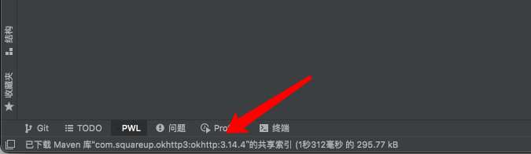

想把文字展示到这个位置，但是没有找到直接的方法。

后发现用过事件日志可以实现，于是把消息写入事件日志。
代码如下:
```
fun sendNotify(project: Project, title: String?, content: String?, type: NotificationType?) {
    NotificationGroupManager.getInstance().getNotificationGroup("com.github.danbai225.pwlchat.notify")
        .createNotification(content!!, type!!)
        .setTitle(title)
        .notify(project)
}
```
需要注册一个组
在`plugin.xml`下添加
```
   <notificationGroup id="com.github.danbai225.pwlchat.notify" displayType="NONE"/>
```
`displayType`类型可以决定消息出现的方式

[代码](https://github.com/danbai225/pwl-chat/blob/main/src/main/kotlin/com/github/danbai225/pwlchat/notify/Notification.kt)
