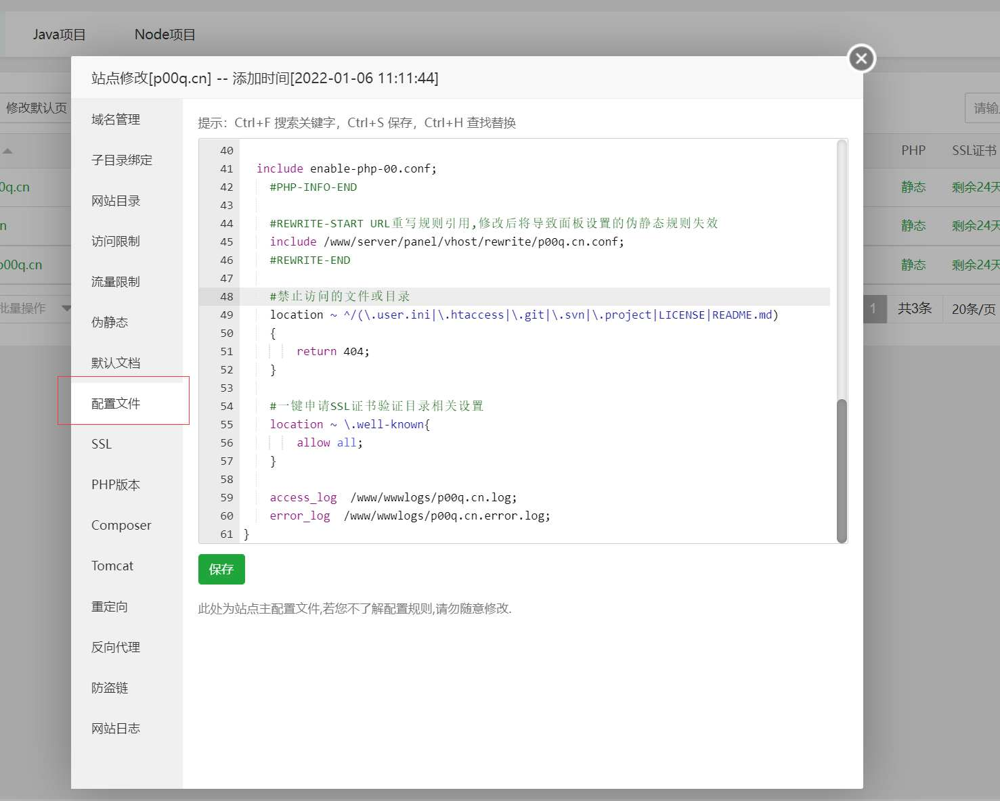
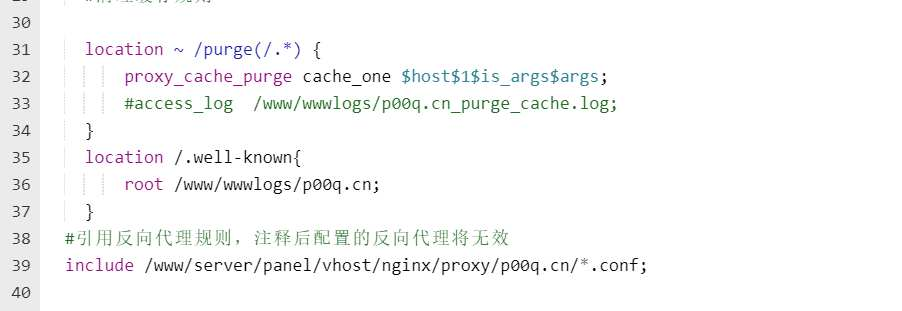

# 免费ssl续签

宝塔提供的一个自动向`Let's Encrypt`申请的免费ssl证书，有效期3个月。
所以在到期前1个月会自动重新申请，但如果你的网站开启了反向代理那么在验证时没法访问到放在你网站根目录下的验证文件。

# 解决办法

很简单，在你的位置设置里找到Nginx配置文件选项



在引用反向代理配置前一行添加

其中请将`/www/wwwlogs/p00q.cn`替换成你的网站根目录
```
    location /.well-known{
        root /www/wwwlogs/p00q.cn;
    }
```
# 验证

访问一下你网站`https://danbai225.github.io/.well-known/`路径出现nginx403就好了
再尝试续签能正常完成即可。
