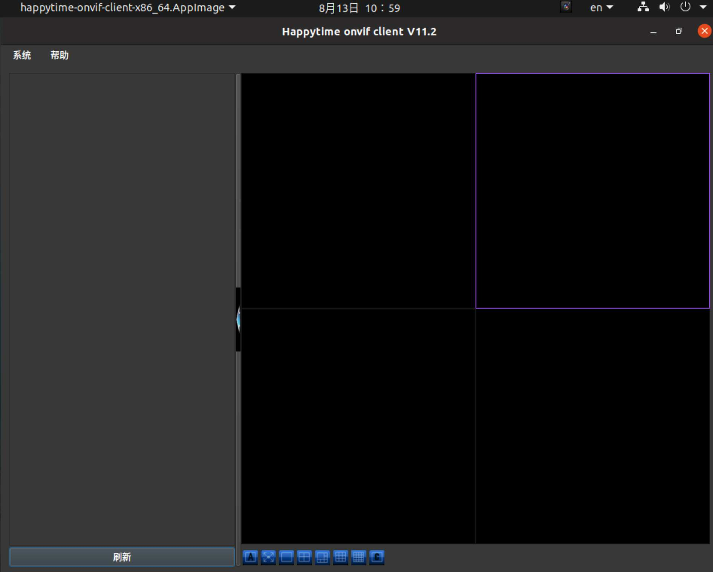
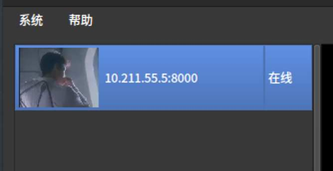
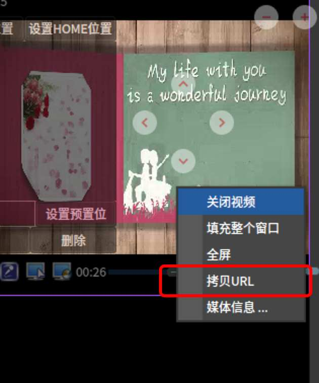
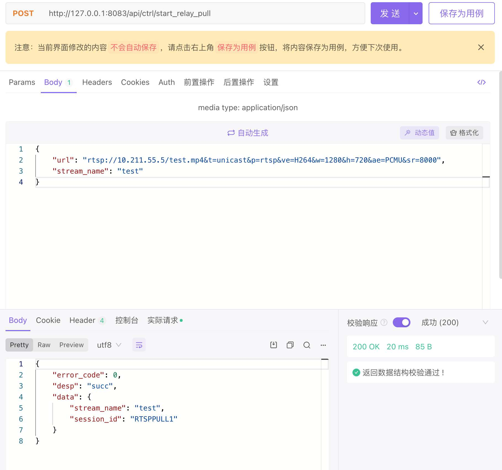
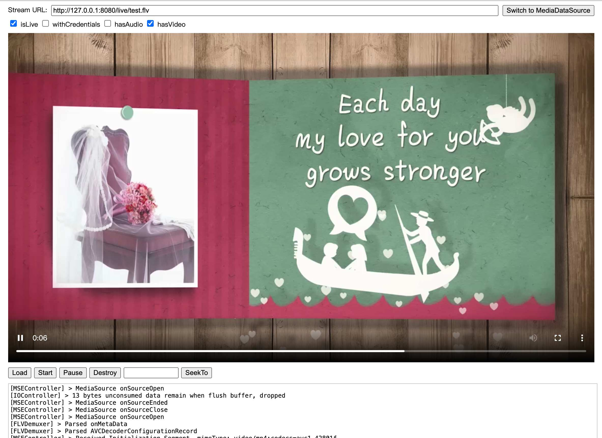

首先了解两个相关协议

# onvif

ONVIF是一个开放的安防行业组织，致力于为安防行业提供和促进标准化开放接口，
以实现IP网络安防产品的有效互操作性。
[官网](http://www.onvif.org/)

# RTSP

实时流协议（Real Time Streaming Protocol，RTSP）是一种网络应用协议，专为娱乐和通信系统的使用，以控制流媒体服务器。该协议用于创建和控制终端之间的媒体会话。媒体服务器的客户端发布VCR命令，例如播放，录制和暂停，以便于实时控制从服务器到客户端（视频点播）或从客户端到服务器（语音录音）的媒体流。

流数据本身的传输不是RTSP的任务。大多数RTSP服务器使用实时传输协议（RTP）和实时传输控制协议（RTCP）结合媒体流传输。然而，一些供应商实现专有传输协议。例如，RealNetworks公司的RTSP服务器软件也使用RealNetworks的专有实时数据传输（RDT）。

RTSP由RealNetworks公司，Netscape公司和哥伦比亚大学开发，第一稿于1996年提交给IETF。由互联网工程任务组（IETF）的多方多媒体会话控制工作组（MMUSIC WG）进行了标准化，并于1998年发布为RFC 2326。 RTSP 2.0 于2016年发布为RFC 7826，作为RTSP 1.0的替代品。RTSP 2.0基于RTSP 1.0，但除了基本的版本协商机制之外不向后兼容。

[维基](https://zh.wikipedia.org/zh-cn/%E5%8D%B3%E6%99%82%E4%B8%B2%E6%B5%81%E5%8D%94%E5%AE%9A)

# 用到的一些网站

- [happytimesoft](https://www.happytimesoft.com/) 一些测试工具

- [常见网络摄像机默认使用的端口，RTSP地址等](https://www.dnsdizhi.com/391.html)

- [lal-流媒体服务器](https://pengrl.com/lal/#/README)


# 主要流程

通过onvif协议连接登陆摄像头，这样就可以设置一些音视频参数和查看rtsp流地址。
部署lal流媒体服务器，调用 lal API接口拉取rtsp流，用户再从 lal 拉取所需的播放格式。

## 需要条件

- 服务器能访问到摄像头ip

- 摄像头支持rtsp、rtmp等视频流

## 使用ONVIF Client连接摄像头 拿到rtsp流地址

[工具下载地址](https://www.happytimesoft.com/products/onvif-client/index.html)

运行工具如下：


左栏右击，添加摄像头。默认如果在一个网段下是会直接扫描出来的。



设置它的登陆信息。可能的默认密码 admin

认证后双击会出现在右侧播放。



复制url，这就是rtsp流地址。

## 添加流地址到lal流媒体服务器

根据官方文档或者拉下[源代码](https://github.com/q191201771/lal)运行服务器

我以源代码运行默认api端口是8083
访问`http://127.0.0.1:8083/api/stat/all_group`
返回
```
{
    "error_code": 0,
    "desp": "succ",
    "data": {
        "groups": null
    }
}
```
### 通过接口添加流地址



再访问`http://127.0.0.1:8083/api/stat/all_group`
```
{
    "error_code": 0,
    "desp": "succ",
    "data": {
        "groups": [
            {
                "stream_name": "test",
                "audio_codec": "",
                "video_codec": "H264",
                "video_width": 1280,
                "video_height": 720,
                "pub": {
                    "session_id": "",
                    "protocol": "",
                    "base_type": "",
                    "start_time": "",
                    "remote_addr": "",
                    "read_bytes_sum": 0,
                    "wrote_bytes_sum": 0,
                    "bitrate": 0,
                    "read_bitrate": 0,
                    "write_bitrate": 0
                },
                "subs": null,
                "pull": {
                    "session_id": "RTSPPULL1",
                    "protocol": "RTSP",
                    "base_type": "PULL",
                    "start_time": "2022-08-13 11:15:33.226",
                    "remote_addr": "10.211.55.5:554",
                    "read_bytes_sum": 1552868,
                    "wrote_bytes_sum": 0,
                    "bitrate": 866,
                    "read_bitrate": 866,
                    "write_bitrate": 0
                }
            }
        ]
    }
}
```

### 播放

根据需要从下面个地址获取播放地址
[lalserver 各协议推拉流url地址列表](https://pengrl.com/lal/#/streamurllist)

通过flv.js 播放http-flv



### 鉴权

通过通知和api调用来达到自定义鉴权
[通知事件](https://pengrl.com/lal/#/HTTPNotify)

# 其他情况

如果遇到无法播放的情况可以看下视频编码是不是h265 尝试更换为h264
或者音频编码是不支持的

