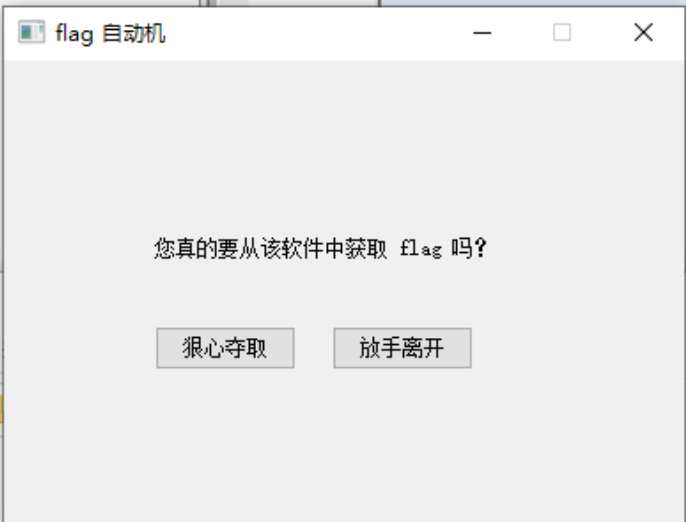
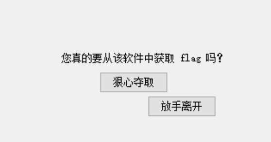
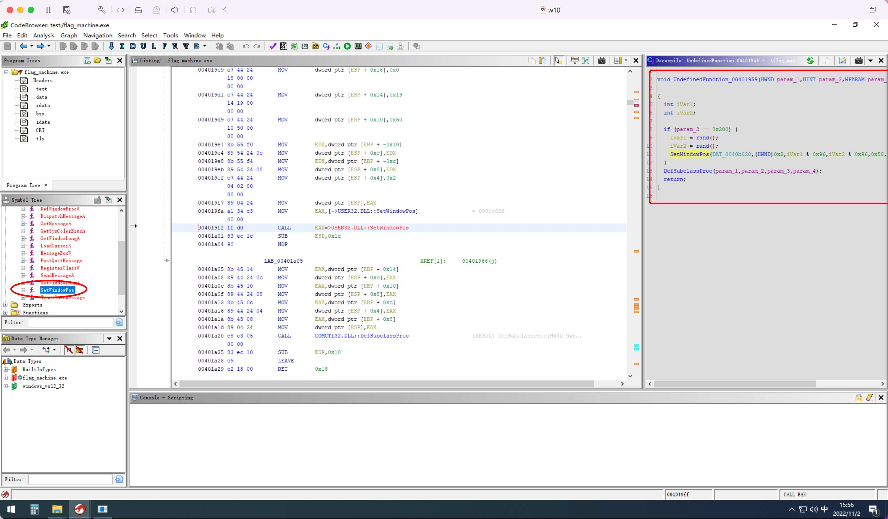
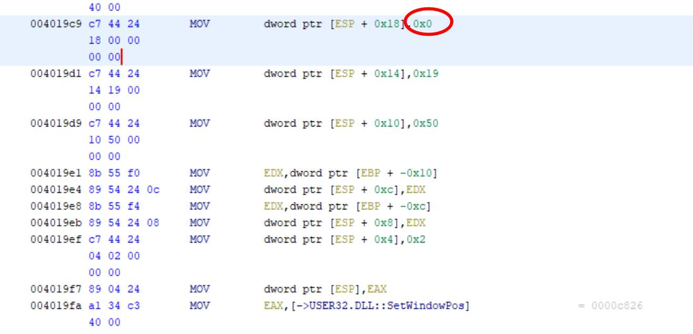
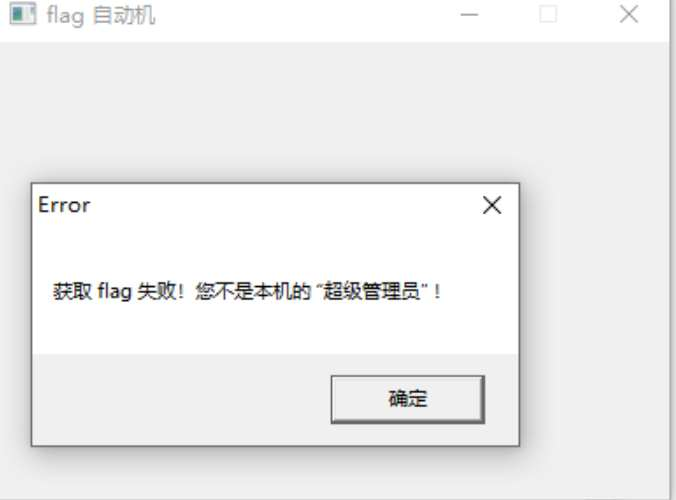
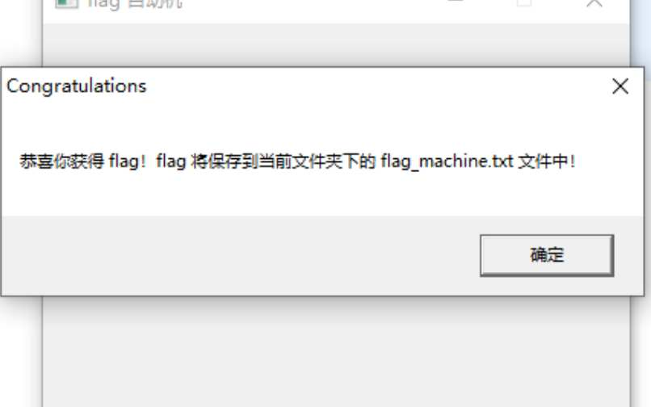

# 第一次参加ctf
在摸鱼之余发现了[Hackergame 2022](https://hack.lug.ustc.edu.cn/)
抽空玩了一下只做出来一道二进制题目和一些web题目以及0道数学题。

还是挺有意思的。

# Flag 自动机

下载题目解压得到 `flag_machine.exe` 之前我使用od调试，由于对od不是很熟就没解出来。

后面我用静态分析工具 `ghidra` 做出来的。

运行`flag_machine.exe`出现如下窗口应该是要点击按钮`狠心夺取`，但是在鼠标移动到按钮边缘就会随机移动一个位置。




这随机移动位置应该是调用了win32api中的`SetWindowPos`通过查找引用找到相关代码如下：

查询了下这个api的参数:
```
//声明:
SetWindowPos(
  hWnd: HWND;            {窗口句柄}
  hWndInsertAfter: HWND; {窗口的 Z 顺序}
  X, Y: Integer;         {位置}
  cx, cy: Integer;       {大小}
  uFlags: UINT           {选项}
): BOOL;

//hWndInsertAfter 参数可选值:
HWND_TOP       = 0;        {在前面}
HWND_BOTTOM    = 1;        {在后面}
HWND_TOPMOST   = HWND(-1); {在前面, 位于任何顶部窗口的前面}
HWND_NOTOPMOST = HWND(-2); {在前面, 位于其他顶部窗口的后面}

//uFlags 参数可选值:
SWP_NOSIZE         = 1;    {忽略 cx、cy, 保持大小}
SWP_NOMOVE         = 2;    {忽略 X、Y, 不改变位置}
SWP_NOZORDER       = 4;    {忽略 hWndInsertAfter, 保持 Z 顺序}
SWP_NOREDRAW       = 8;    {不重绘}
SWP_NOACTIVATE     = $10;  {不激活}
SWP_FRAMECHANGED   = $20;  {强制发送 WM_NCCALCSIZE 消息, 一般只是在改变大小时才发送此消息}
SWP_SHOWWINDOW     = $40;  {显示窗口}
SWP_HIDEWINDOW     = $80;  {隐藏窗口}
SWP_NOCOPYBITS     = $100; {丢弃客户区}
SWP_NOOWNERZORDER  = $200; {忽略 hWndInsertAfter, 不改变 Z 序列的所有者}
SWP_NOSENDCHANGING = $400; {不发出 WM_WINDOWPOSCHANGING 消息}
SWP_DRAWFRAME      = SWP_FRAMECHANGED; {画边框}
SWP_NOREPOSITION   = SWP_NOOWNERZORDER;{}
SWP_DEFERERASE     = $2000;            {防止产生 WM_SYNCPAINT 消息}
SWP_ASYNCWINDOWPOS = $4000;            {若调用进程不拥有窗口, 系统会向拥有窗口的线程发出需求}

```
发现 `uFlags` 有个值可以忽略xy，
现在程序中 `SetWindowPos(DAT_0040b020,(HWND)0x2,iVar1 % 0x96,iVar2 % 0x96,0x50,0x19,0);`  `uFlags`是0只需要把它改成2就好了

在汇编中找到代码位置


修改为`0x2` 后导出运行程序。

虽然成功点击了按钮但是确弹出了一个新的消息框。
消息框的api是`MessageBoxW`继续查找相关引用
找到如下相关代码：
```
void UndefinedFunction_00401510(HWND param_1,UINT param_2,WPARAM param_3,int param_4)

{
  uint uVar1;
  HFONT wParam;
  char *_Str;
  FILE *_File;
  size_t _Count;
  
  if (param_2 == 2) {
    PostQuitMessage(0);
  }
  else if (param_2 == 0x111) {
    if ((short)param_3 == 2) {
      PostQuitMessage(0);
    }
    if ((short)param_3 == 3) {
      if (param_4 == 0x1bf52) {
        _Str = FUN_00401f8a();
        MessageBoxW(param_1,
                    L"恭喜你获得 flag！flag 将保存到当前文件夹下的 flag_machine.txt 文件中！"
                    ,L"Congratulations",0);
        _File = fopen("flag_machine.txt","w");
        if (_File == (FILE *)0x0) {
          MessageBoxW(param_1,L"文件打开错误！",L"Error",0);
          free(_Str);
                    /* WARNING: Subroutine does not return */
          exit(-1);
        }
        _Count = strlen(_Str);
        fwrite(_Str,1,_Count,_File);
        fclose(_File);
        free(_Str);
      }
      else {
        MessageBoxW(param_1,L"获取 flag 失败！您不是本机的 “超级管理员” ！",
                    L"Error",0);
      }
    }
  }
  else if (param_2 == 1) {
    DAT_0040b020 = CreateWindowExW(0,L"Button",L"狠心夺取",0x50000000,0x55,0x96,0x50,0x19,
                                   param_1,(HMENU)0x3,(HINSTANCE)0x0,(LPVOID)0x0);
    DAT_0040b024 = CreateWindowExW(0,L"Button",L"放手离开",0x50000000,0xb9,0x96,0x50,0x19,
                                   param_1,(HMENU)0x2,(HINSTANCE)0x0,(LPVOID)0x0);
    DAT_0040b028 = CreateWindowExW(0,L"Static",(LPCWSTR)PTR_DAT_00409004,0x50000000,0x55,100,300,
                                   0x14,param_1,(HMENU)0x1,(HINSTANCE)0x0,(LPVOID)0x0);
    uVar1 = GetWindowLongA(param_1,-0x10);
    SetWindowLongA(param_1,-0x10,uVar1 & 0xfffeffff);
    wParam = CreateFontW(0xc,0,0,0,400,0,0,0,0x86,0,0,2,0x12,L"宋体");
    SendMessageA(param_1,0x30,(WPARAM)wParam,1);
    SendMessageA(DAT_0040b020,0x30,(WPARAM)wParam,1);
    SendMessageA(DAT_0040b024,0x30,(WPARAM)wParam,1);
    SendMessageA(DAT_0040b028,0x30,(WPARAM)wParam,1);
  }
  DefWindowProcW(param_1,param_2,param_3,param_4);
  return;
}

```
看来目前是进到了 `if ((short)param_3 == 3)`的if中但是`(param_4 != 0x1bf52)`所以弹出了这个消息框。
找到相关汇编判断代码：
```
        0040180a 81 7d 14        CMP        dword ptr [EBP + 0x14],0x1bf52
                 52 bf 01 00
        00401811 74 2d           JZ         LAB_00401840
```
 [汇编跳转相关代码介绍](https://blog.csdn.net/zmmycsdn/article/details/78511948)

这里用的跳转是 `JZ` 为零则跳转 那么可以改为 `JNZ ` 不为零则跳转。实现了取反的效果。

再次导出运行：

成功得到flag

之前对汇编不是很熟所以做的过程中也不是很顺利。借助了`ghidra` 这款好用的静态分析工具才完成。还好之前写过一些windows程序对win32还有点印象。


