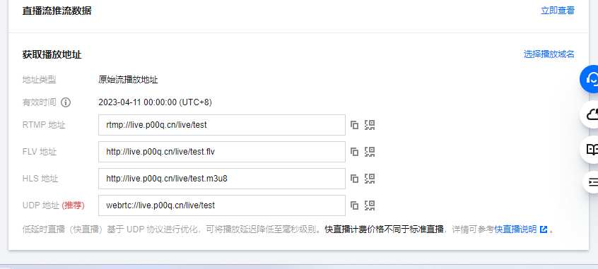

# 原始需求

需要在非公开直播平台进行一场线上直播。如果用腾讯会议、飞书等软件不满足人数要求，大概会有300人左右在线观看。需要让直播延迟很低即时效果好延迟控制在1s以内。在这种需求下让我想到了webrtc，

> WebRTC (Web Real-Time Communication) 是一个支持实时视频、音频和数据传输的开放式网络协议和技术标准。它允许在Web浏览器之间进行点对点通信，而无需安装插件或其他软件。
> WebRTC是由Google发起并开发，并在W3C和IETF等标准组织中得到认可。它基于JavaScript API和HTML5技术构建，使用了标准的网络通信协议，如UDP、TCP和HTTP，并支持多媒体编解码器，如VP8、VP9、Opus等。
> WebRTC主要应用于视频会议、在线教育、在线客服、多人游戏、远程协作等实时通信场景。与传统的视频通信方案相比，WebRTC以其低延迟、高清晰度、易于使用和免费等优势，越来越受到开发者和企业的青睐。

# 基于腾讯云云直播服务推流

既然需要快速搭建可用服务，那么自己写webrtc服务肯定是来不及了，而且还需要大的带宽服务器这也是不小的花费。为了节省时间和减少费用开销，这里我采用腾讯云提供的云直播服务支持webrtc。

需要准备一个域名以及一个腾讯云账号

## 登录腾讯云添加云直播域名

[云直播域名管理](https://console.cloud.tencent.com/live/domainmanage)
默认会有一个推流域名，需要自己添加一个播放域名并完成认证。


## 开始推流直播

没错就这么快连直播工具都无需下载直接开始直播。先在地址是生成器中生成一个推流地址
会生成很多种推流方式地址，这里我们为了实现低延迟采用webrtc的推流方式。
[推流地址生成](https://console.cloud.tencent.com/live/addrgenerator/addrgenerator)
在这里粘贴我们复制的webrtc直播推流地址。
[web推流直播](https://console.cloud.tencent.com/live/tools/webpush)
通过web推流进行直播，可以选着窗口或屏幕进行分享。
推流后就可以看到我们的播放地址：


## 播放直播
实测在推流端和播放端不在同一网络情况下（wifi与手机流量）
推流端以1080p60fps的情况进行推流，播放延迟任然保持在1s以内。

因为使用了webrtc所以在播放时也需要专门的播放器：
可以使用腾讯云提供的在线demo播放
[播放器demo](https://tcplayer.vcube.tencent.com/)
或者自己根据腾讯云提供的sdk写一个简单的播放页面下面这是一个例子:
```
<!DOCTYPE html>
<html lang="en">

<head>
    <meta charset="UTF-8">
    <meta http-equiv="X-UA-Compatible" content="IE=edge">
    <meta name="viewport" content="width=device-width, initial-scale=1.0">
    <title>在线播放器</title>
    <style>
        body {
            display: flex;
            flex-direction: column;
            align-items: center;
            justify-content: center;
            height: 100vh;
            margin: 0;
            padding: 0;
        }

        .container {
            display: flex;
            flex-direction: column;
            align-items: center;
            justify-content: center;
        }

        .video-section {
            margin-top: 20px;
            margin-bottom: 20px;
        }
    </style>
</head>

<body>
    <h1>视频播放器</h1>
    <div class="container">
        <div class="input-section">
            <label for="video-url">输入视频URL：</label>
            <input type="text" id="video-url" placeholder="https://example.com/video.mp4">
            <button id="play-btn">播放</button>
        </div>
        <section class="video-section">
            <video id="player-container-id" width="414" height="270" preload="auto" playsinline webkit-playsinline>
            </video>
        </section>
    </div>
    <link href="https://web.sdk.qcloud.com/player/tcplayer/release/v4.7.2/tcplayer.min.css" rel="stylesheet" />
    <!--播放器脚本文件-->
    <script src="https://web.sdk.qcloud.com/player/tcplayer/release/v4.7.2/tcplayer.v4.7.2.min.js"></script>
    <script>
        const playButton = document.getElementById("play-btn");
        const player = TCPlayer('player-container-id', {});
        playButton.addEventListener("click", () => {
            const videoUrl = document.getElementById('video-url').value;
            if (videoUrl) {
                player.src(videoUrl);
                player.play();
            }
        });
    </script>
</body>
</html>
```
把这个html部署到服务器或者本地打开使用都行。
注意的是浏览器最好都使用最新的谷歌浏览器。
如有遇到实在播放不了的情况可以使用flv地址进行播放。延迟会增加1-2s

