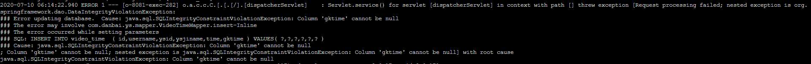

# 遇到如下问题


字段`gktime`不能为null
这是表结构：

设置字段`gktime`有默认值
# 解决

MySQL 5.6版本引入

explicit_defaults_for_timestamp

来控制对timestamp NULL值的处理


如果该参数不开启，则对timestamp NOT NULL插入NULL值，不报错，无warning，插入后的值为当前时间

如果在my.cnf中explicit_defaults_for_timestamp=1

那么插入该值的时候会报错提示该列can not be null

设置该值
```
set global explicit_defaults_for_timestamp=0;
```
或者修改`my.cnf`
```
explicit_defaults_for_timestamp = 0
```