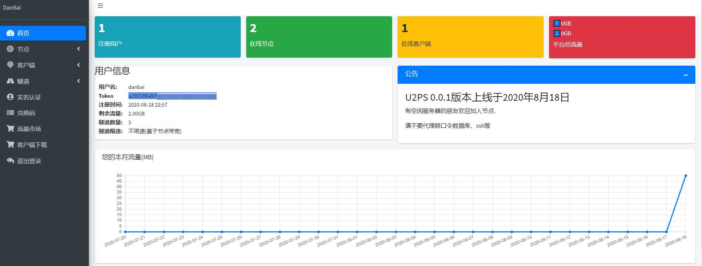

# U2PS
&emsp;&emsp;U2PS内网穿透平台,用户可以将自己的空闲服务器以Node身份加入平台,其他用户则可以选择Node进行内网传统,其他用户在Node上产生的流量将计入Node所属用户的账号。
- TCP、UDP、HTTP、SOCKS5代理
- Web操作界面配置简单
- 热更新无需重启客户端即可更新隧道
- 节点多、各国IP,基于Node数。
# 2020年8月18日
今日U2PS已经上线了.

# 2020年8月14日-8月17日

- 完成了web端对节点、客户端、隧道的增删改查.
- 对接了支付和实名认证.

# 2020年8月10日-8月14日

- 将服务端进行分离，把web和服务端分别独立出来。以防修改web端要重启服务端，会影响到node和客户端。
- web端通过dubbo调用服务端。
- 流量统计功能完善。
- 运行环境试用容器部署（已经完成环境搭建可以直接打包到docker仓库，然后k8s调整版本发布了）。

# 2020年8月1日-8月10日

- 服务端Api框架,与客户端、Node端通信。
- 客户端和Node端基础功能(TCP、UDP、HTTP、SOCKS5)代理,已经大致完成开发现在开始主要开发服务端和前端的对接。