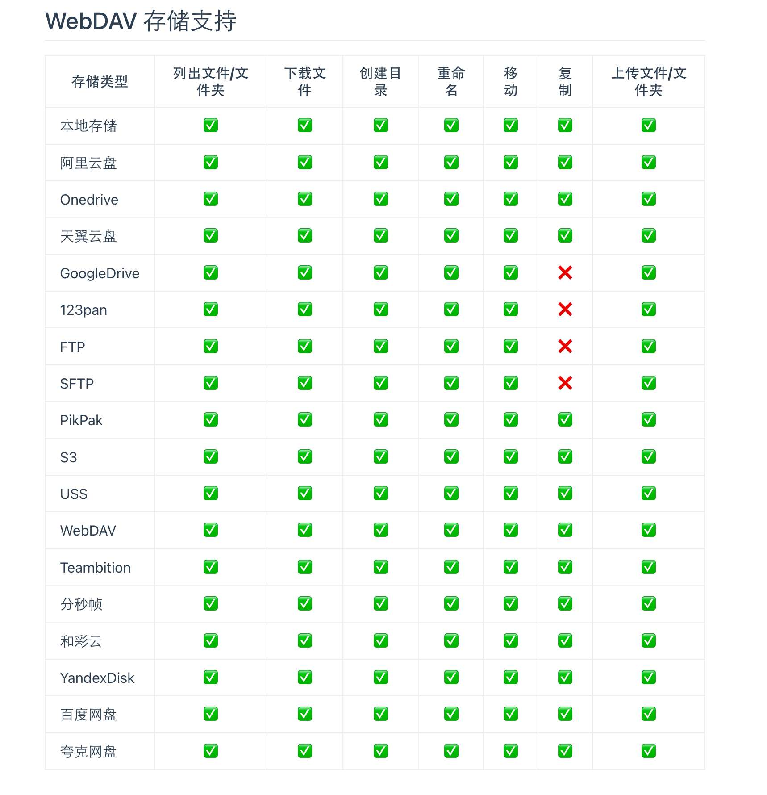

#  alist

一个可以把各网盘、云存储、本地存储统一管理的开源程序。

[仓库地址](https://github.com/alist-org/alist/blob/main/README_cn.md)

[demo](https://pan.nn.ci/)

# 围绕webdav开发

alist提供webdav服务，方便在一个接口下载不同网盘的文件。

# 想法

通过把多个网盘、云储、本地存储联系起来。通过webdav套娃的方式实现统一管理。

达到的目的，无需保存到自己的云盘，也可以下载别人分享的文件。

分享文件的方式更直接，不需要再走网盘分享链接。
