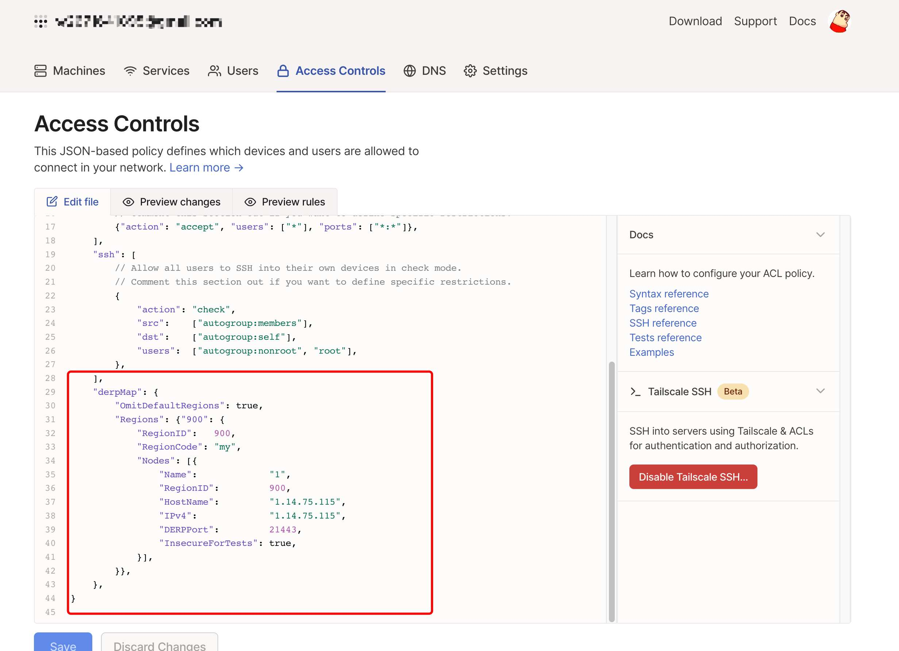

# 使用docke-compose快速部署
```
version: '3.3'
services:
  yangchuansheng:
    restart: always
    network_mode: host
    container_name: derper
    environment:
      - DERP_HTTP_PORT=2180
      - 'DERP_ADDR=:21443'
    image: ghcr.io/yangchuansheng/ip_derper
```
`docker-compose up -d`
开放端口3478 还有配置中的端口
端口根据自身情况进行修改
# 修改管理配置
```

```
"derpMap": {
		"Regions": {"900": {
			"RegionID":   900,
			"RegionCode": "my",
			"Nodes": [{
				"Name":             "1",
				"RegionID":         900,
				"HostName":         "1.14.75.115",
				"IPv4":             "1.14.75.115",
				"DERPPort":         21443,
				"InsecureForTests": true,
			}],
		}},
	},
```
保存重启客户端


教程来源：https://icloudnative.io/posts/custom-derp-servers/