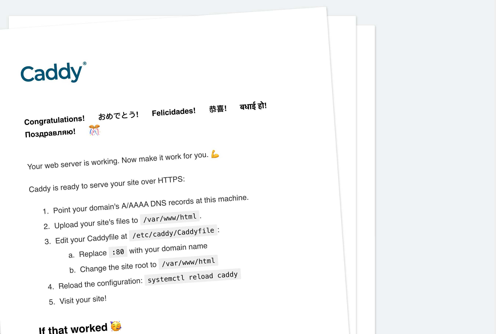

# caddy 介绍
Caddy 是一个强大的、可扩展的平台，可以为您的站点、服务和应用程序提供服务，用 Go 编写。
大多数人将Caddy用作Web服务器或代理，但Caddy的本质是诸多服务器的服务器。在安装了必要的模块后，它就可以充当长时间运行的进程的角色！

基于Caddy的API，它的配置能被动态修改，且能导出来。虽然不需要配置文件，但你仍然可以使用它们；大多数人还是最喜欢通过Caddyfile对Caddy进行配置。虽然通过配置适配器可以对Caddy使用多种的配置文件格式，但它的原生配置语言是JSON。
免费签发ssl证书
Caddy已经编译好了所有主流平台的版本，且没有运行时依赖项。
[官网](https://caddyserver.com/docs/)

# 安装

根据 [Install](https://caddyserver.com/docs/install) 中的各系统安装步骤完成安装。

安装成功后
```
root@VM-0-3-ubuntu:~# caddy version
v2.5.2 h1:eCJdLyEyAGzuQTa5Mh3gETnYWDClo1LjtQm2q9RNZrs=
```
执行
```
sudo systemctl enable --now caddy
sudo systemctl start --now caddy
```
访问服务器 [ip](http://1.14.75.115) 可以看到


## 修改配置

文件路径 `/etc/caddy/Caddyfile`
```
:80 {
	root * /usr/share/caddy
	file_server
}

p00q.cn {
	encode gzip
	reverse_proxy 127.0.0.1:1001
}
```
重载或者重启服务
```
sudo systemctl reload caddy
sudo systemctl restart caddy
```
通过域名访问即可

[配置详解](https://caddyserver.com/docs/caddyfile-tutorial)

# 遇到的问题

手动执行`/usr/bin/caddy run --environ --config /etc/caddy/Caddyfile` 
运行后网站是能正常进行访问的。
但是在使用`systemctl start caddy` 启动的服务访问返回403

可能的情况是

- 网站根目录没有权限
- SELinux设置为开启状态