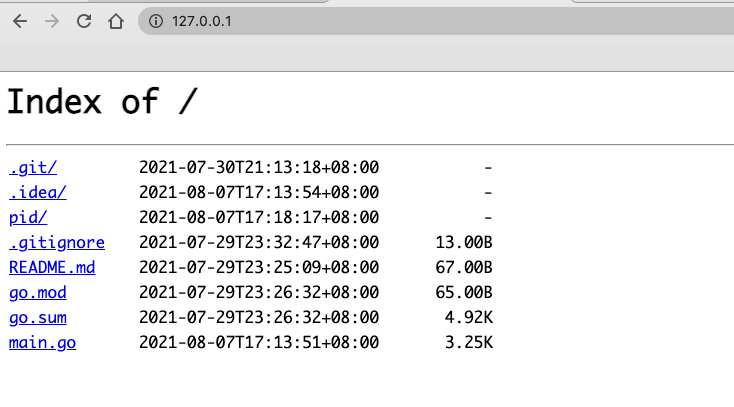

# 守护进程

守护进程（daemon）是运行在后台的进程，类似使用`nohup`命令一样。
这种进程 ppid=1 且在UNIX系统进程层级中直接位于init之下。

[守护进程-维基百科](https://zh.wikipedia.org/wiki/%E5%AE%88%E6%8A%A4%E8%BF%9B%E7%A8%8B)

# 僵尸进程

当一个进程创建了一个子进程，这个子进程退出后父进程没有调用 `wait()` 正确回收子进程们的进程描述符时，子进程就成了僵尸进程继续占用进程资源。

# 使用go创建一个守护进程
```GO
package main

import (
	"flag"
	"fmt"
	"github.com/gin-gonic/gin"
	"io/ioutil"
	"net/http"
	"os"
	"os/exec"
	"path/filepath"
	"strconv"
	"strings"
	"syscall"
	"time"
)

//https://www.cnblogs.com/tobycnblogs/p/9981796.html
var daemon bool
var launcher bool

func init() {
	flag.BoolVar(&daemon, "d", false, "是否为守护启动模式")
	flag.BoolVar(&launcher, "l", false, "Launcher")
	flag.Parse()
	if launcher {
		return
	}
	if os.Getppid() != 1 && daemon && len(os.Args) >= 2 {
		arg := make([]string, 0)
		if len(os.Args) > 3 {
			arg = os.Args[3:]
		}
		cmdStr := os.Args[2]
		cmdStr += strings.Join(arg, "")
		cmd := exec.Command(os.Args[2], arg...)
		stat, err := os.Stat("pid/")
		if err != nil || !stat.IsDir() {
			os.Mkdir("pid/", 0777)
		}
		cmd.Start()
		syscall.Umask(27)
		pidFile := fmt.Sprintf("pid%c%s.pid", os.PathSeparator, cmdStr)
		file, err := os.OpenFile(pidFile, os.O_WRONLY|os.O_TRUNC|os.O_CREATE, 0644)
		defer file.Close()
		if err == nil {
			file.WriteString(strconv.Itoa(cmd.Process.Pid))
		}
		os.Exit(0)
	} else if !launcher {
		go checkPidRun()
	}
}
func checkPidRun() {
	for {
		rd, err := ioutil.ReadDir("pid/")
		if err == nil {
			for _, fi := range rd {
				if !fi.IsDir() {
					path := fmt.Sprintf("pid%c%s", os.PathSeparator, fi.Name())
					bytes, err := ioutil.ReadFile(path)
					if err == nil {
						pid, _ := strconv.ParseInt(string(bytes), 10, 32)
						if !checkPid(int(pid)) {
							os.Remove(path)
						}
					}
				}
			}
		}
		time.Sleep(time.Second)
	}
}
func main() {
	if launcher {
		if len(os.Args) >= 2 {
			u := daemonRun(os.Args[2])
			print(u)
			os.Exit(0)
		}
	} else {
		router := gin.Default()
		router.POST("/run", run)
		router.Run(":8080")
	}
}
func run(c *gin.Context) {
	a := struct {
		Cmd string `json:"cmd"`
	}{}
	if err := c.ShouldBindJSON(&a); err != nil {
		c.AbortWithStatusJSON(
			http.StatusOK,
			gin.H{"error": err.Error()})
		return
	}
	
	command := exec.Command(ExecPath(), "-l", a.Cmd)
	out, _ := command.CombinedOutput()
	parseUint, _ := strconv.ParseUint(string(out), 10, 32)
	c.JSON(http.StatusOK, gin.H{"msg": "ok", "data": map[string]interface{}{
		"pid": parseUint,
	}})
	return
}

func daemonRun(cmd string) uint {
	split := strings.Split(cmd, " ")
	split = append([]string{ExecPath(), "-d"}, split...)
	attr := &os.ProcAttr{
		Dir: "./",
		Env: os.Environ(),
		Files: []*os.File{
			os.Stdin,
			os.Stdout,
			os.Stderr,
		},
		Sys: &syscall.SysProcAttr{
			//Chroot:     d.Chroot,
			Setsid: true,
		},
	}
	if c, err := os.StartProcess(ExecPath(), split, attr); err == nil {
		defer c.Release()
		pidFile := fmt.Sprintf("pid%c%s.pid", os.PathSeparator, strings.ReplaceAll(cmd, " ", ""))
		time.Sleep(time.Second)
		bytes, err := ioutil.ReadFile(pidFile)
		if err == nil {
			parseUint, _ := strconv.ParseUint(string(bytes), 10, 32)
			return uint(parseUint)
		}
		c.Wait()
	}
	return 0
}

var appPath = ""

func ExecPath() string {
	if appPath == "" {
		file, err := exec.LookPath(os.Args[0])
		if err != nil {
			return ""
		}
		appPath, _ = filepath.Abs(file)
	}
	return appPath
}

// Will return true if the process with PID exists.
func checkPid(pid int) bool {
	process, err := os.FindProcess(pid)
	if err != nil {
		return false
	}
	err = process.Signal(syscall.Signal(0))
	if err != nil {
		return false
	} else {
		return true
	}
}


```
使用命令 `go run main.go`

运行这个段代码会开启一个 8080 端口的web程序。通过调用 `:8080/run` 

会执行 `a web` 命令，该命令是运行一个 80 端口的 web 服务程序。
返回守护进程的 pid 

```
{
"data": {
    "pid": 6515
},
"msg": "ok"
}
```


然后退出我们编写的程序，80 端口依然能访问。
```
ps -ef|grep "a web"
501  6515     1   0  5:18下午 ??         0:01.02 a web
```
# 实现原理

在api进程中创建一个进程①，在进程一中创建一个进程②在进程②中执行所需要运行的命令，然后进程②退出执行命令的进程将变成孤儿进程由init（pid=1）管理。但是这时由于进程②的退出产生了一个僵尸进程在进程①中调用 `Wait()` 函数释放进程符。然后再退出进程①。
我这里fork了两次其实fork一次也行。

# GitHub
[go-daemons-api](https://github.com/danbai225/go-daemons-api)