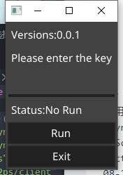

# 如何让u2ps客户端运行在安卓上.

在网上找到了几种方法,可以把go打包成aar安卓调用.
为了快速开发,我采用[fyne跨平台界面库](fyne)开发.

需要环境:
GO、安卓sdk、ndk
首先 `go get fyne.io/fyne`安装fyne
编写app.go

```go

package main

import (
	"fyne.io/fyne/app"
	"fyne.io/fyne/widget"
	"os"
	"u2ps/client"
	"u2ps/common"
)
type enterEntry struct {
	widget.Entry
}

func newEnterEntry() *enterEntry {
	entry := &enterEntry{}
	entry.ExtendBaseWidget(entry)
	return entry
}
func main() {
	//converts a  string from UTF-8 to gbk encoding.
	a := app.New()
	w := a.NewWindow("U2PS")
	entry := newEnterEntry()
	state := widget.NewLabel("Status:No Run")
	bt := widget.NewButton("Run", func() {
		if len(entry.Text)>=1{
			state.SetText("Status:Run")
			entry.Hidden = true
			common.Key = entry.Text
			entry.Text=""
			common.HostInfo = "server.u2ps.com:2251"
			common.MaxRi = 10
			go client.Conn()
		}
	})
	w.SetContent(widget.NewVBox(
		widget.NewLabel("Versions:"+common.Versions),
		widget.NewLabel("Please enter the key"),
		entry,
		state,
		bt,
		widget.NewButton("Exit", func() {
			os.Exit(1)
		})))
	w.ShowAndRun()
}

```
使用命令行命令编译成apk也可以是exe等其他平台执行文件:
`fyne package -os android -appID com.example.myapp`
# 运行展示
apk:

exe:

