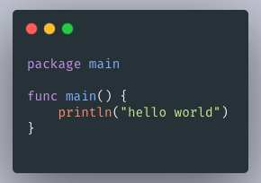

# 使用[carbon](https://carbon.now.sh/)制作


这是一个nodejs开发的在线代码截图生成工具。



# 使用Go调用生成代码截图

实现原理：由于carbon是需要运行再浏览器通过前端dom生成的图片。所以需要通过谷歌无头浏览器来实现。

go有两个相关的开源库

- [https://github.com/chromedp/chromedp](https://github.com/chromedp/chromedp)

- [https://github.com/go-rod/rod](https://github.com/go-rod/rod)

我先是使用了第一个开源库，但是觉得有些繁琐便尝试了第二个库。很棒有中文的文档，api使用起来简单了许多。

carbon可以通过url传入参数但由于前端渲染只支持get请求所以无法传入过长的代码片段。所以我采用了模拟输入的方式来输入代码再通过获取dom的宽高获取截图大小实现长截图。

```Go
func code2Img(code string, Options ...map[string]string) ([]byte, error) {
  var carbonOptions = map[string]string{
    "bg":     "rgba(74,144,226,1)", // 背景颜色
    "t":      "VSCode",             // 主题
    "wt":     "none",               // 窗口主题
    "l":      "auto",               // language
    "ds":     "true",               // 阴影
    "dsyoff": "15px",               // dropShadowOffsetY
    "dsblur": "25px",               // dropShadowBlurRadius
    "wc":     "true",               // 窗口控件
    "wa":     "true",               // 宽度调整
    "pv":     "30px",               // 填充垂直
    "ph":     "50px",               // 填充水平
    "ln":     "true",               // 行号
    "fl":     "1",                  // 第一个行号
    "fm":     "Source Code Pro",    // 字体系列
    "fs":     "13.5px",             // 字体大小
    "lh":     "152%",               // 行高
    "si":     "false",              //平方图像
    "es":     "1x",                 // 出口尺寸
    "wm":     "false",              // 水印
  }
  if len(Options) > 0 {
    for k, v := range Options[0] {
      carbonOptions[k] = v
    }
  }
  values := url.Values{}
  for k, v := range carbonOptions {
    values.Set(k, v)
  }
  var browser *rod.Browser

  if path, exists := launcher.LookPath(); exists {
    u := launcher.New().Bin(path).Set("--disable-gpu").Headless(true).MustLaunch()
    browser = rod.New().ControlURL(u).MustConnect()
  } else {
    browser = rod.New().MustConnect()
  }
  defer browser.Close()
  urlstr := "https://carbon.supermario.vip/?" + values.Encode() + "&code=t"
  page := browser.MustPage()
  err := rod.Try(func() {
    page.Timeout(10 * time.Second).MustNavigate(urlstr)
  })
  if err != nil {
    return nil, err
  }
  //defer page.Close()
  pt := page.MustElement(".CodeMirror-lines").MustShape().OnePointInside()
  //模拟鼠标键盘
  mouse := page.Mouse
  keyboard := page.Keyboard
  //移动输入代码
  mouse.MustMove(pt.X, pt.Y-10)
  mouse.MustDown("left")
  mouse.MustUp("left")
  keyboard.MustDown('\b')
  keyboard.MustUp('\b')
  split := strings.Split(code, "\n")
  for i, s := range split {
    if i == len(split)-1 {
      keyboard.InsertText(s)
    } else {
      keyboard.InsertText(s + "\n")
    }
  }
  element := page.MustElement("#export-container")
  box := element.MustShape().Box()
  //logs.Info(box.Width, box.Height)

  element.MustEval(`
getxy =function(){
var element=document.getElementById('export-container')
//计算x坐标
  var actualLeft = element.offsetLeft;
  var current = element.offsetParent;
  while (current !== null){
    actualLeft += current.offsetLeft;
    current = current.offsetParent;
  }
  //计算y坐标
  var actualTop = element.offsetTop;
  var current = element.offsetParent;
  while (current !== null){
    actualTop += (current.offsetTop+current.clientTop);
    current = current.offsetParent;
  }
  //返回结果
  return {x: actualLeft, y: actualTop}
}
`)
  vals := page.MustEval("getxy()")
  img, _ := page.Screenshot(true, &proto.PageCaptureScreenshot{
    Format:  proto.PageCaptureScreenshotFormatJpeg,
    Quality: 90,
    Clip: &proto.PageViewport{
      X:      vals.Get("x").Num(),
      Y:      vals.Get("y").Num(),
      Width:  box.Width,
      Height: box.Height,
      Scale:  2,
    },
    FromSurface: true,
  })
  return img, nil
```


