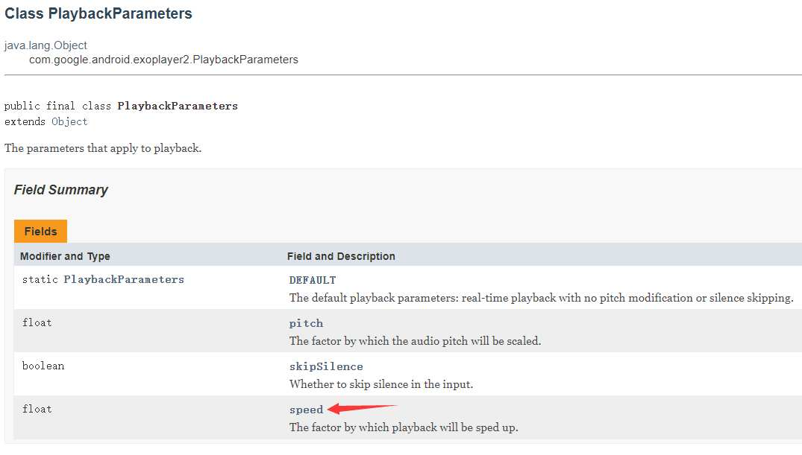

# 为啥要在 Flutter 实现
&emsp;&emsp;在前面我用 Flutter 完成了影视 APP 的开发。在各电视剧拖拖拉拉的剧情节奏有时就需要快进，但怕错过一些重要剧情内容。所以倍速播放一直让我头疼。在安卓那边有许多播放器直接就支持倍速播放。但我在前期开发 Flutter的应用的时候并没有去仔细寻找支持倍速播放的播放器就选择了官方的 Video_Player 进行开发。

flutter支持倍速播放的播放器：
- [fijkplayer](https://fijkplayer.befovy.com/)
- [flt_video_player](https://github.com/RandyWei/flt_video_player/blob/master/README_CN.md)

# 实现倍速

&emsp;&emsp;在看了Video_Player的源码后知道Video_Player在安卓这边是封装的 [Exoplayer](https://exoplayer.dev/) 播放器 查看官方文档发现Exoplayer是支持倍速播放的。现在我只需要实现 Flutter 与原生的通信就行了。
这个类的 `Speed` 参数控制的就是播放倍速

通过 `SimpleExoPlayer.SetPlaybackParameters` 方法来修改
```
void setSpeed(double value) {
      float bracketedValue = (float) value;
      PlaybackParameters existingParam = exoPlayer.getPlaybackParameters();
      PlaybackParameters newParameter =
          new PlaybackParameters(bracketedValue, existingParam.pitch, existingParam.skipSilence);
      exoPlayer.setPlaybackParameters(newParameter);
    }
```
# 效果展示

通过 `VideoPlayerController` 下 `setSpeed（）` 方法修改播放速度。
<video src="https://danbai.oss-cn-chengdu.aliyuncs.com/bk/Record_2020-07-11-18-26-55_f802aed858f448d1131af0_1594463673230.mp4" controls="controls" width="480" height="640">
Your browser does not support the video tag.
</video>

[项目地址](https://github.com/danbai225/plugins/tree/master/packages/video_player)仅实现了安卓

[受此启发](https://github.com/flutter/plugins/pull/1400)