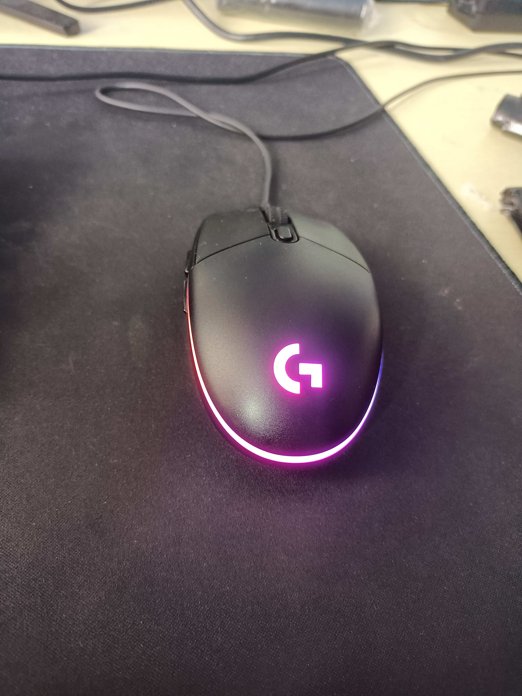

# 产品介绍
该鼠标是一款轻巧舒适的鼠标。也支持宏设定和流光灯效(二代)，重要的是舒服耐造。

[jd直连](https://item.jd.com/10023004841906.html)

# 使用感受

我第一次购买是2019-5,购买价格为129元。是那时我买过最贵的鼠标到现在也是。之前我一直都是买的那种外观酷炫笨重的游戏鼠标用不了多久就会出现各种问题，几十块一个就一直换。直到遇见了G102。在今年4月购入了第二代109元，现在公司里用的一代家里用的二代。手感很舒适没有突起圆润，打游戏也很行。

