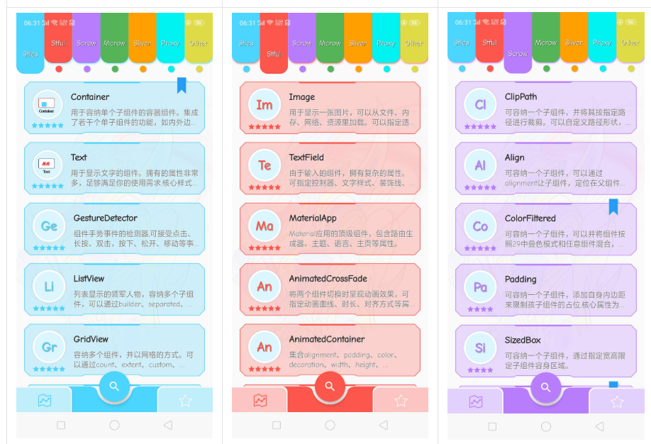
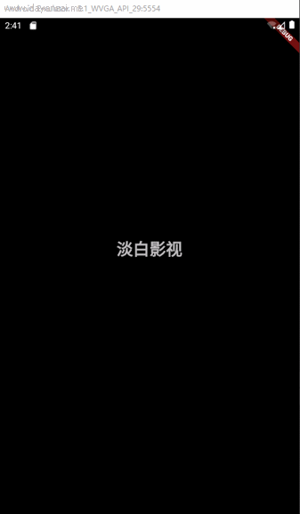

# 开篇
Flutter一个跨平台UI开发框架.2018发布1.0当时只是了解了下并没有学习.近来学习了一下Flutter并运用到了开发中.

# 学习Dart
学习Flutter得先学习Flutter所采用的开发语言Dart.
Dart是一门由Google开发的面向对象的语言.语法和Java和JavaScript很相似.Java开发者半个小时就能上手.
## Dart 的特性:
- 单进程异步事件模型；
- 强类型，可以类型推断；
- DartVM，具有极高的运行效率和优秀的代码运行优化，根据早前的基准测试， - 性能比肩 Java7 的JVM；
- 独特的隔离区( Isolate )，可以实现多线程；
- 面向对象编程，一切数据类型均派生自 Object ；
- 运算符重载，泛型支持；
- 强大的 Future 和 Stream 模型,可以简单实现高效的代码；
- Minix 特性，可以更好的实现方法复用；
- 全平台语言，可以很好的胜任移动和前后端的开发。
- 在语法上，Dart 提供了很多便捷的操作，可以明显减少代码量。比如字符连接，可以直接 "my name is $name, age is $age"，无需+号拼接，也无需做类型转换。
```
void main() {
  var str='Hello, World!';
  print(str);
}
```
输出:
```
Hello, World!
```
Dart官方文档:[文档](https://www.dartcn.com/guides/language/language-tour#%E9%87%8D%E8%A6%81%E7%9A%84%E6%A6%82%E5%BF%B5)

# Flutter运行环境安装
官网[官方教程](https://flutterchina.club/get-started/install/)
下载完Flutter的SDK后配置环境变量
进入IDEA或Android Studio安装Dart和Flutter的插件.
cmd运行
```flutter doctor```检查安装情况
# Flutter组件
官方组件文档:[文档](https://flutterchina.club/widgets/)
推荐一个组件Demo项目:[Github](https://github.com/toly1994328/FlutterUnit)

刚开始很多组件用不明白就多看看这个.记录了大部分组件的使用演示和代码以及常用属性



Flutter组件开发结构比安卓的xml结构开发更清晰加上Flutter热编译速度快
马上就能看到效果,加快了开发速度.
[教程地址](https://www.bilibili.com/video/BV1JE411e7Tu?)

# 使用Flutter进行项目开发
项目地址:[Github](https://github.com/danbai225/dbys_flutter)

# 简单的启动动画实现
可提交预加载首页数据

```
class BootAnimation extends StatefulWidget {
  BootAnimation({Key key}) : super(key: key);
  @override
  _BootAnimation createState() => _BootAnimation();
}

class _BootAnimation extends State<BootAnimation>
    with SingleTickerProviderStateMixin {
  AnimationController _controller;
  Color xzColor = Colors.black;
  @override
  void initState() {
    super.initState();
    getSyData();
    var duration = new Duration(seconds: 3); //定义一个三秒种的时间
    new Future.delayed(duration, () {
      //设置定时执行
      goToHomePage();
    });
    _controller = new AnimationController(
      duration: const Duration(milliseconds: 2000),
      vsync: this,
    );
    _controller.addListener(() {
      setState(() {
        print(_controller.value);
        if (_controller.value == 1) {
          xzColor = Colors.grey;
        }
      });
    });
    _controller.forward();
  }
  @override
  void dispose() {
    _controller.dispose();
    super.dispose();
  }
  // 重写build 方法，build 方法返回值为Widget类型，返回内容为屏幕上显示内容。
  @override
  Widget build(BuildContext context) {
    return Scaffold(
      body: Container(
          decoration: BoxDecoration(color: Colors.black),
          child: Center(
              child: Container(
            width: 200,
            height: 100,
            child: Column(
              children: <Widget>[
                Opacity(
                    opacity: _controller.value,
                    child: Text(
                      "淡白影视",
                      style: TextStyle(
                          fontSize: 36 * _controller.value,
                          fontWeight: FontWeight.bold,
                          color: Colors.white),
                    )),
                Text(
                  "看你想看",
                  style: TextStyle(fontSize: 16, color: xzColor),
                )
              ],
            ),
          ))),
    );
  }
  goToHomePage() {
    Navigator.of(context).pushReplacementNamed("/MainPage"); //执行跳转代码
  }

  //获取首页数据并存储
  getSyData() async {
    var response = await http.get("https://dbys.vip/sy");
    Future<SharedPreferences> _prefs = SharedPreferences.getInstance();
    SharedPreferences prefs = await _prefs;
    prefs.setString("syData", response.body);
  }
}
```
# 总结
坑比较多,得慢慢填.热编译容易出问题,在修改逻辑代码代码可能需要重新编译才行.
修改玩部分代码后直接编译不过.不是代码的问题 是缓存的锅


Flutter虽然跨平台和ui性能比较强,单终究是要运行在安卓和ios上的.如果需要调用硬件和系统api就得依靠原生.

Flutter的优势主要还是在UI方面.其次就是开发上手比较快.前端后端学起来都比较容易.还是值得一学.


