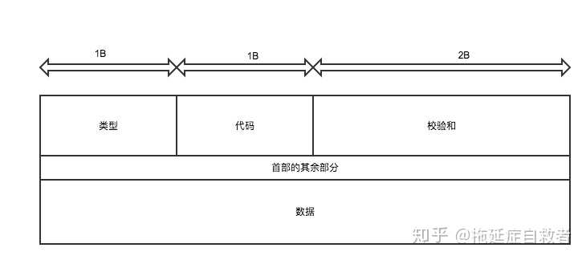

面试时聊到了一些网络知识。其中ping这个东西，是我经常用到的但似乎对它又不是很了解，于是去看了下相关协议的介绍。它使用了一种协议叫[ICMP（Internet Control Message Protocol）Internet控制报文协议](https://baike.baidu.com/item/ICMP)。
报文结构：
其中校验和计算：
1. 将校验和字段置为0。
2. 将每两个字节（16位）相加（二进制求和）直到最后得出结果，若出现最后还剩一个字节继续与前面结果相加。
(溢出)将高16位与低16位相加，直到高16位为0为止。
3. 将最后的结果（二进制）取反。
```Go
func CheckSum(data []byte) uint16 {
	var sum uint32 //uint32符合校验位站2字节
	var length = len(data)
	var index int
	for index <= length-2{
		//对每两个字节相加 其中对每两字节中的第一个字节左移8位再加上后面一位 组成一个16位数加到结果中
		sum += uint32(data[index]) << 8 + uint32(data[index+1])
		index += 2
	}
	//如果有单独一个字节也按照16位进行相加
	if length%2==1{
		sum += uint32(data[length-1])<<8
	}
	//sum >> 16 高16位的值加32位的sum 取32位中低16位的值再取反
	sum += sum >> 16
	return uint16(^sum)
}
```
参考：
https://blog.csdn.net/zhj082/article/details/80518322